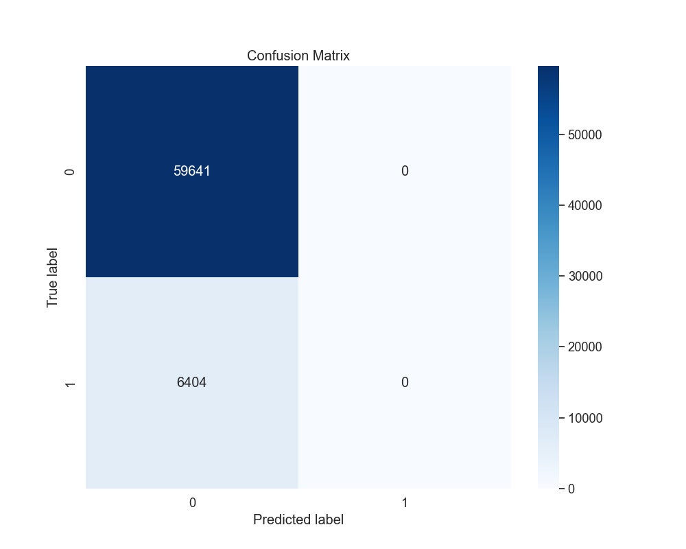
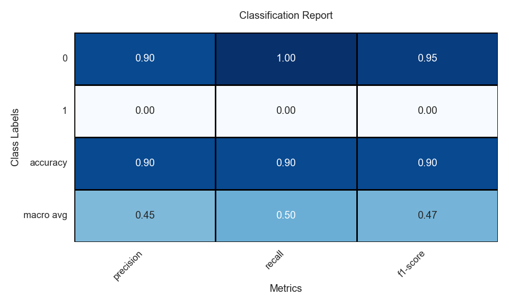
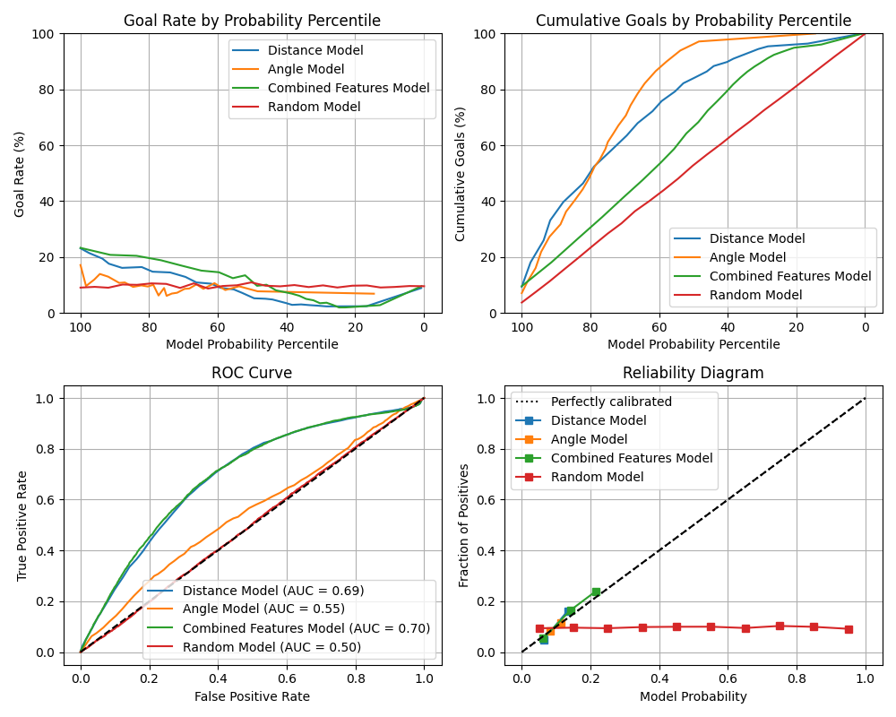
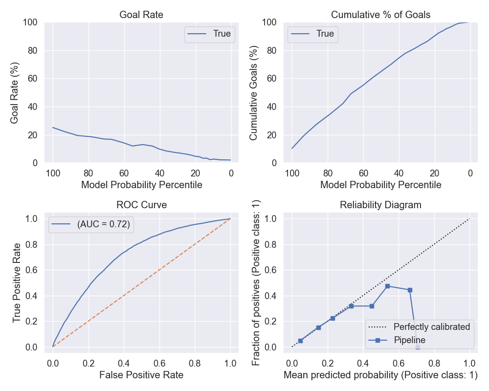
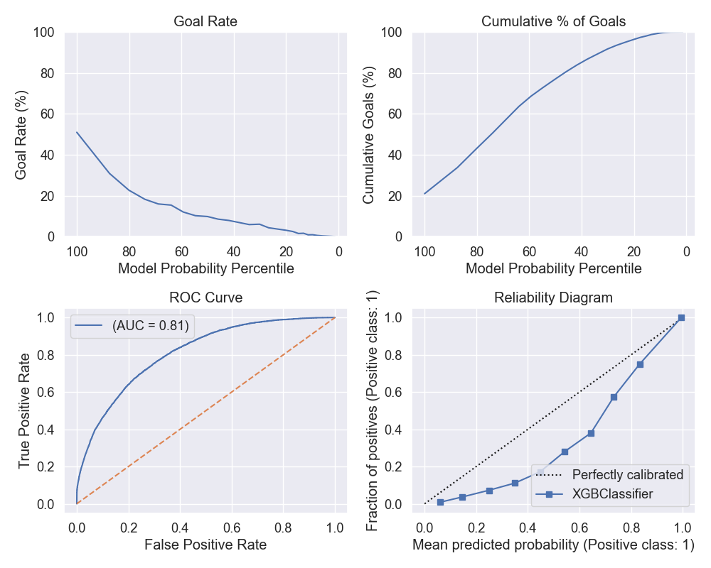
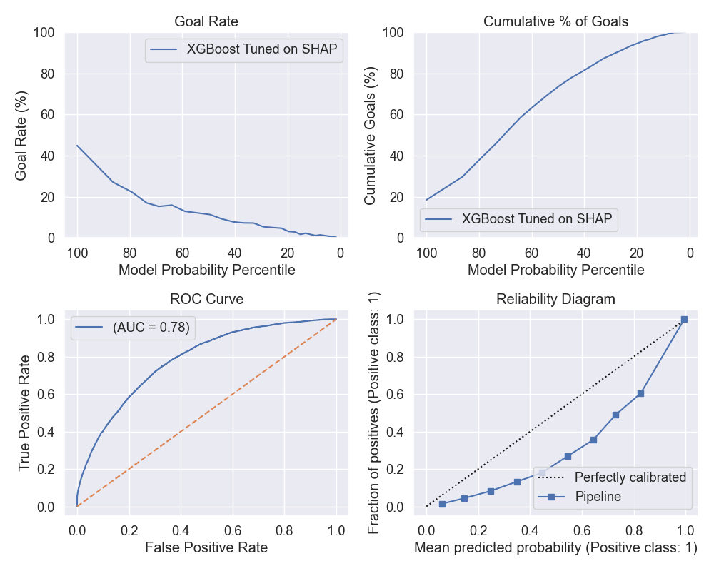
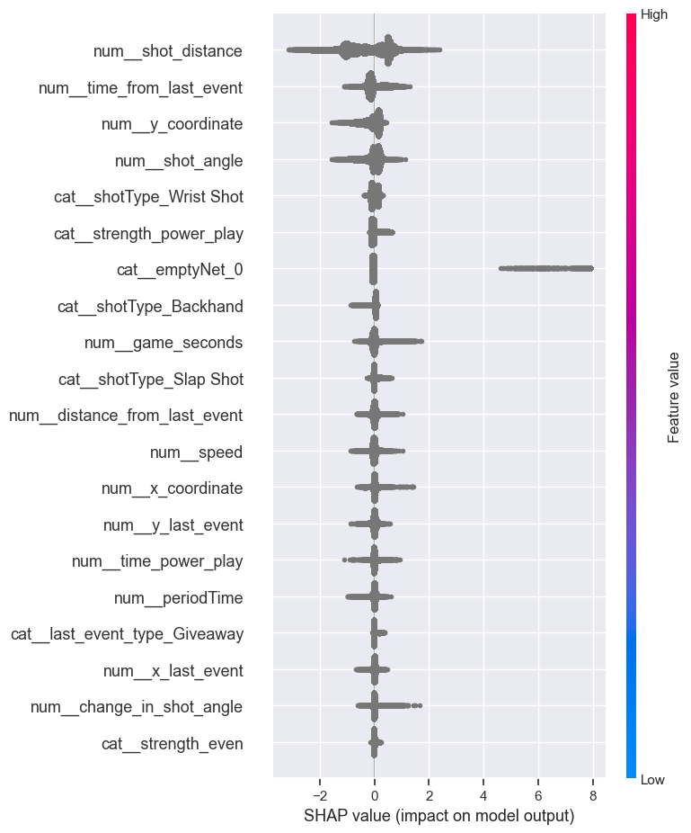

# Experiment Tracking with Comet.ml

## Introduction to Experiment Tracking

Experiment tracking is a fundamental aspect of machine learning projects, allowing data scientists to log, monitor, and compare different models and their performance. [Comet.ml](https://www.comet.ml) is a powerful tool that provides a seamless experience for this purpose.

## Setting Up Comet.ml

To begin with Comet.ml, sign up and create an account. After setting up your project, you can start tracking experiments with a simple script:


```python
from comet_ml import Experiment
experiment = Experiment(
    api_key="your-api-key",
    project_name="your-project-name",
    workspace="your-workspace"
)
```

## Organizing Experiments
A well-organized workflow is key to managing experiments. Comet.ml offers an intuitive interface to categorize and filter experiments:

## Avoiding Jupyter Notebooks for Experiments
While Jupyter Notebooks are great for exploration, they are not ideal for running reproducible experiments. Python scripts are preferred, and Comet.ml integrates more effectively with them.

## Tracking Experiments
Logging experiments is straightforward in Comet.ml. Here is how you log metrics and parameters:

```python
# Log metrics and parameters
experiment.log_metric("accuracy", accuracy_score)
experiment.log_parameter("regularization_rate", 0.01)
```

## Reproducibility
Comet.ml shines when it comes to reproducibility, providing all the necessary details to recreate experiments, ensuring that models are not just effective but also transparent.

## References
[Comet ml Documentation](https://www.comet.ml/docs/) <br>
[Saving Scikit-Learn Models](https://scikit-learn.org/stable/modules/model_persistence.html) <br>
[Saving XGBoost Models](https://xgboost.readthedocs.io/en/latest/python/python_intro.html#model-saving-and-loading) <br>

#  Baseline Model 

## Question 1 

<table>
  <tr>
    <td>
      
      <br>
      <em>Figure 3: Confusion Matrix for Baseline Logistic Regression on distance feature</em>
    </td>
    <td>
      
      <br>
      <em>Figure 4: Classification report for Baseline Logistic Regression on distance feature</em>
    </td>
  </tr>
</table>

[Comet Experiment for Baseline Question 1](https://www.comet.com/2nd-milestone/baseline-model/44e0b40478234797adcdc68fa11d8c50?experiment-tab=images)

[Comet Experiment for Baseline Question 2](https://www.comet.com/2nd-milestone/baseline-model/e4f54d90a4044c57ba30e1930e97c5c0?experiment-tab=images)

The accuracy for the baseline model `LogisticClassifier` using only `shot_distance` is `90.3%`. However, further analysis as shown in `classification_report` reveals that the model is predicting `not_goal` label for every goal given as input. This is also apparent in the `percision` and `recall` for `is_goal` label which is zero. 

Looking more deeply at the dataset shows that this data is higly unbalanced. As can be seen in the following graph, only a small portion of the data (less than 10%) are the shots that actually led to goals. Therefore, the model predicts every shot to be shot rather than a goal when it is actually a goal. 


This calls for a better treatment of imbalanced class either by using advanced models or by data augmentation. Following URL consists of the details of the experiment ran.

[Comet Experiment Link](https://www.comet.com/2nd-milestone/baseline-model/44e0b40478234797adcdc68fa11d8c50?experiment-tab=panels&showOutliers=true&smoothing=0&xAxis=wall)


## Question 3 

[Comet Experiment for Baseline Question 3](https://www.comet.com/2nd-milestone/baseline-model/52edc2c0320f42b8810bcbb28b4d7448?experiment-tab=images)

### Goal rate as a function of Model probability percentile 
This figure considers the true goal rate in the validation set binned by the models's probability percentile equal cut. 

So all the results for all features suggest that the actual observed rate of achieving the goal is low when the model predicted probabilities are within $[0, 22]$. We can see the probabilites which to true values among these three are coming from the model trained on all features; `shot_distance` and `shot_angle`. 
The random model is a horizontal line accross are bins which suggest that it does not align within and care to the actual data probabilty.

### Cumulative Goals as a function of Model probability percentile 
Ideally, if the slope of the model is 0, it means the model assigns high probabilities to a larger proportion of the actual positive outcomes, which is desirable. However, it can be counter-intuitive argument towards overfitting.

By cumulating the goals according to the percentiles of probability, we can observe of how much of the goals are explained by the model, and how confident it is. The random model is a diagonal line which suggests that it does not align within and care to the actual data probabilty.

The slope of this plot indicates how much of the goals are captured within a range of best percentiles of goal probabilities. A flat slope indicates there are very few goals explained by the range of probabilities, such that a prediction within the 40% lowest probabilities of the `Angle Model` indicates a low chance of goal.
A high slope indicates many goals are being captured by the range of probabilities, such that a prediction within the 20% highest probabilities of the `Angle Model` and  `Distance Model` indicates a high chance of goal.

When we consider the Random model, although the slope is steady and constant but the values it ascertains are very low. This is because the model is not able to capture the actual data probabilty. The top 20%ile explains as much as top 80%ile.

### ROC curve
The ROC curve shows the True positive rate $\frac{TP}{TP + FN}$ and False positive rate $\frac{FP}{FP+TN}$. A model that has 0 slope or AUC of 1 is the ideal model that explained the true probabilities perfectly. This curve evaluate the performance of a binary classification model across various thresholds, and provides a measure of specificity and sensitivity. The random classifier being a diagonal line aligns with our prediction. We can see that the `shot_angle` feature has lowest performance among other features. This also shows itself in the curve associated with the both features. We can see that the curve of both features is very close to the curve with only `shot_distance` feature indicative of a similar performance. 

### Calibration curve
A perfectly calibrated model would follow the dotted diagonal line, indicating that the predicted probabilities match the observed frequencies. Points or lines below the diagonal indicate overconfidence; points or lines above indicate underconfidence.

The combined features models (`shot_angle` and `shot_distance` ) are very close to the diagonal line. This means that the model is well calibrated. However, it's only able to 
~22% of the positives (goals).

The model trained on `shot_angle` feature is not well calibrated as it explains even less than 20% of the positives (goals).

The Random model explains the constant fraction of positives over it's entire probability range. This is because the model is not able to capture the actual data probabilty.


# Advanced Models

## Question 1
[Comet Experiment](https://www.comet.com/2nd-milestone/advanced-model/de8450185d4a455f975f54b2b2c032ec?experiment-tab=images)


| XGBoost Classifier | Logistic Regression Baseline |
|:------------------:|:----------------------------:|
|  |  |
| *Figure 3: Baseline XGBoost on distance and angle features* | *Figure 4: Baseline Logistic Regression on distance and angle features* |

- **Training and Validation Setup**: The training and validation setup for the XGBoost classifier is the same as the setup for the Logistic Regression baseline. The training set consists of data from 2015-16, 2016-17, 2017-18 and the validation set is the season 2018-2019. Season 2019-2020 has been set aside for the test set to be used in later sections.

- **Comparison to Logistic Regression Baseline**: The XGBoost classifier performs better than the Logistic Regression baseline. 
    - The goal rate versus probability percentile curve for the Baseline XGBoost classifier explains a greater proportion of the goals than the Logistic Regression baseline. It is able to distinguish between the goals and non-goals better even though the explained goals remains almost the same
    - The cumulative goals proportion curve for the Baseline XGBoost classifier is closer to the diagonal line than the Logistic Regression baseline, indicating worse performance on this metric
    - The area under the curve for reciever operating characteristics for XGBoost (0.72) is greater than that of any model of Logistic Regression (max: 0.7), indicating a better performance.
    - The reliability curve for the Baseline XGBoost classifier is able to explain probabilities perfectly till $0.35$ post which it fizzles out, zeroing (counter predicting) post 0.6 probability of goal. On the other hand the best baseline Logistic Regression is only able to explain till $0.22$.

## Question 2
[Comet Experiment](https://www.comet.com/2nd-milestone/advanced-model/6f870834944f47b280fc6b6758973abd?experiment-tab=images)


| XGBoost Tuned | XGBoost Baseline |
|:------------------:|:----------------------------:|
|  |  |
| *Figure 3: Hyperparameter Tuned XGBoost on all features* | *Figure 4: Baseline XGBoost on all features* |

- **Hyperparameter Tuning**: The method involved exploring a range of values for each parameter that influences the model's learning process. We adjusted parameters such as the number of trees, learning rate, tree depth, and others that define the model's complexity and training process. We used Sequential Model-Based Optimization (SMBO) with the Tree Parzen Estimator (TPE), a variant of Bayesian Optimization that looks for the distribution maximizing the evaluation score.
During this optimization phase, we measured the model's performance by calculating the macro-average F1 score. This approach is particularly beneficial when dealing with uneven class distributions. We iterated through 100 different parameter combinations, each time fitting the model, making predictions, and recording the F1 score. The objective was to find the parameter set that maximizes the F1 score, corresponding to the lowest loss in our optimization procedure. The resulting best-performing model parameters will be presented in the blog post, accompanied by visual aids that demonstrate the impact of various hyperparameter values on the model's performance. These visuals will help clarify the tuning process and validate the selection of our final model parameters.

- **Comparison to XGBoost Baseline**:
    - The goal rate versus probability percentile curve for the tuned XGBoost classifier explains a greater proportion of the goals than the XGBoost baseline. It is able to distinguish between the goals and non-goals better even though the explained goals remains almost the same
    - The slope for cumulative goals proportion curve for the tuned XGBoost classifier is closer to the ideal slope of 0 as compared to the XGBoost Baseline indicating better performance on this metric. 
    - The area under the curve for reciever operating characteristics for tuned XGBoost (0.82) is greater than that of the XGBoost baseline (0.72), indicating a better performance.
    - The reliability curve for the tuned XGBoost classifier is able to explain all probabilities. However it's far from the perfectly calibrated. On the other hand, the XGBoost Baseline explains probabilities upto 0.35 but then the results are abysmal. Overall, the tuned model is better calibrated than the baseline model.

## Question 3
[Comet Experiment](https://www.comet.com/2nd-milestone/advanced-model/37c5eb9d5b714833b70322de2ec68f88?experiment-tab=images)


| XGBoost Tuned after Feature Selection| XGBoost Tuned | XGBoost Baseline |
|:------------------:|:----------------------------:| :------------------:|
|  |  |  |
| *Figure 3: Hyperparameter Tuned XGBoost on all features* | *Figure 4: Baseline XGBoost on all features* | *Figure 5: Baseline XGBoost on all features* |

- **Feature Selection**: We used the SHAP library to identify the most important features for our model. SHAP is a game-theoretic approach to explain the output of any machine learning model. SHAP values interpret the impact of having a certain value for a given feature in comparison to the prediction we'd make if that feature took some baseline value. The following are the mean shapley values we got per feature. As an experiment we chose top 10 features for modelling



- **Comparison to other XGBoost Models**: 
    - The goal rate as a function of model probability percentile curve for the tuned XGBoost classifier after feature selection explains a less proportion of the goals than the tuned XGBoost classifier before feature selection. 
    - The slope for cumulative goals proportion curve for the tuned XGBoost classifier after feature selection is almost the same as the tuned XGBoost classifier before feature selection indicating similar performance on this metric.
    - The area under the curve for reciever operating characteristics for tuned XGBoost after feature selection (0.78) is less than that of the tuned XGBoost before feature selection (0.82), indicating a worse performance.
    - The reliability curve for the tuned XGBoost classifier after feature selection is similar to the tuned XGBoost classifier before feature selection. Both are able to explain all probabilities. However, the tuned XGBoost classifier before feature selection tend to be closer than ideal in predicted probabilities closer to 1 indicating a better calibration. 

Overall, Both of the XGBoost models perform better than the XGBoost baseline for the reasons already described.


