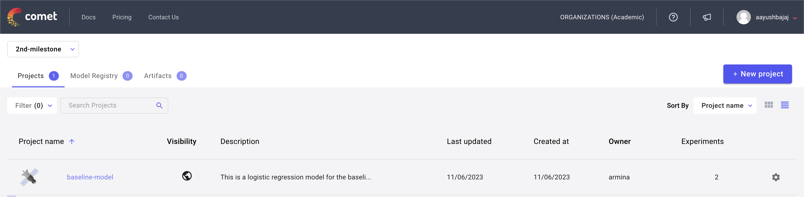
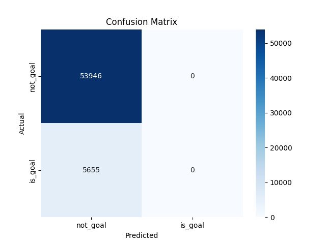
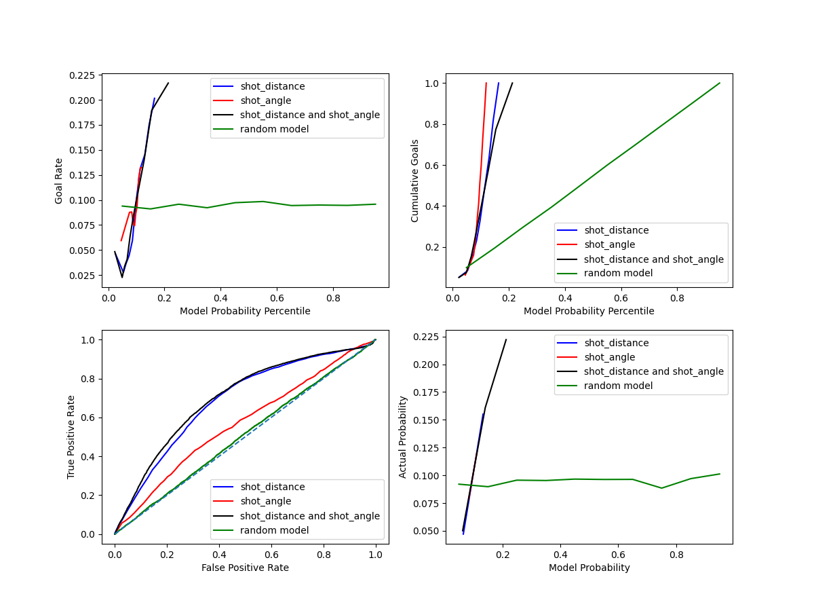

# Experiment Tracking with Comet.ml

## Introduction to Experiment Tracking

Experiment tracking is a fundamental aspect of machine learning projects, allowing data scientists to log, monitor, and compare different models and their performance. [Comet.ml](https://www.comet.ml) is a powerful tool that provides a seamless experience for this purpose.

## Setting Up Comet.ml

To begin with Comet.ml, sign up and create an account. After setting up your project, you can start tracking experiments with a simple script:



```python
from comet_ml import Experiment
experiment = Experiment(
    api_key="your-api-key",
    project_name="your-project-name",
    workspace="your-workspace"
)
```

## Organizing Experiments
A well-organized workflow is key to managing experiments. Comet.ml offers an intuitive interface to categorize and filter experiments:

## Avoiding Jupyter Notebooks for Experiments
While Jupyter Notebooks are great for exploration, they are not ideal for running reproducible experiments. Python scripts are preferred, and Comet.ml integrates more effectively with them.

## Tracking Experiments
Logging experiments is straightforward in Comet.ml. Here is how you log metrics and parameters:

```python
# Log metrics and parameters
experiment.log_metric("accuracy", accuracy_score)
experiment.log_parameter("regularization_rate", 0.01)
```

## Reproducibility
Comet.ml shines when it comes to reproducibility, providing all the necessary details to recreate experiments, ensuring that models are not just effective but also transparent.

## References
[Comet ml Documentation](https://www.comet.ml/docs/) <br>
[Saving Scikit-Learn Models](https://scikit-learn.org/stable/modules/model_persistence.html) <br>
[Saving XGBoost Models](https://xgboost.readthedocs.io/en/latest/python/python_intro.html#model-saving-and-loading) <br>

#  Baseline Model 

## Question 1 
The accuracy for the baseline model `LogisticClassifier` using only `shot_distance` is `95.51%`. However, further analysis as shown in `classification_report` and `   `confusion_matrix` reveals that the model is prediction `not_goal` label for every shot given as input. This is also apparent in the `percision` and `recall` for `is_goal` label which is zero. 




Looking more deeply at the dataset shows that this data is higly unbalanced. As can be seen in the following graph, only a small portion of the data (less than 20%) is the shots that actually led to goals. Therefore, the model predicts every shot to be shot rather than a goal when it is actually a goal. 


## Question 2 
Here using only the `distance` feature, we demonstate plots for (a)  ROC and AUC curves with the random classifier model, (b) The goal rate as a function of the shot probability model percentile, (c) the cumulative poportions of goals as a function of shot probability model percentile, (d) the realiability diagram. 

### Shot Distance 


## Question 3 


<div style="text-align: center;">
    
</div>

## Question 4 

Here, we present the links for programs written for this Task. Programs written for this task are `baseline.py`, `utils_ar_pa.py` and `baseline2.py`. The first only considers the baseline `LogisticRegression()` classifier with only `shot_distance` feature. The second programs includes the functions to create these figures. The last one, combines all features to have an integreated subplot. 
- [Baseline model](https://www.comet.com/2nd-milestone/baseline-model/d485ba3099ca4d9694823b2bf5ae0721?experiment-tab=panels&showOutliers=true&smoothing=0&xAxis=wall)
- [Figures]() 


