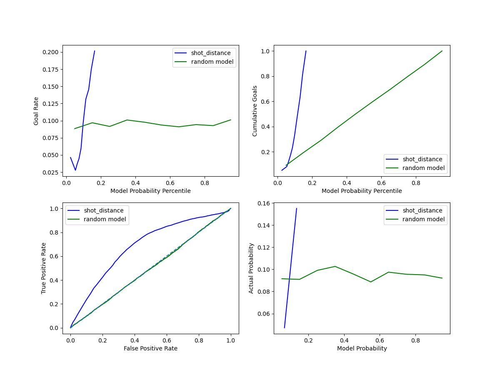

# Experiment Tracking with Comet.ml

## Introduction to Experiment Tracking

Experiment tracking is a fundamental aspect of machine learning projects, allowing data scientists to log, monitor, and compare different models and their performance. [Comet.ml](https://www.comet.ml) is a powerful tool that provides a seamless experience for this purpose.

## Setting Up Comet.ml

To begin with Comet.ml, sign up and create an account. After setting up your project, you can start tracking experiments with a simple script:


```python
from comet_ml import Experiment
experiment = Experiment(
    api_key="your-api-key",
    project_name="your-project-name",
    workspace="your-workspace"
)
```

## Organizing Experiments
A well-organized workflow is key to managing experiments. Comet.ml offers an intuitive interface to categorize and filter experiments:

## Avoiding Jupyter Notebooks for Experiments
While Jupyter Notebooks are great for exploration, they are not ideal for running reproducible experiments. Python scripts are preferred, and Comet.ml integrates more effectively with them.

## Tracking Experiments
Logging experiments is straightforward in Comet.ml. Here is how you log metrics and parameters:

```python
# Log metrics and parameters
experiment.log_metric("accuracy", accuracy_score)
experiment.log_parameter("regularization_rate", 0.01)
```

## Reproducibility
Comet.ml shines when it comes to reproducibility, providing all the necessary details to recreate experiments, ensuring that models are not just effective but also transparent.

## References
[Comet ml Documentation](https://www.comet.ml/docs/) <br>
[Saving Scikit-Learn Models](https://scikit-learn.org/stable/modules/model_persistence.html) <br>
[Saving XGBoost Models](https://xgboost.readthedocs.io/en/latest/python/python_intro.html#model-saving-and-loading) <br>

#  Baseline Model 

## Question 1 
The accuracy for the baseline model `LogisticClassifier` using only `shot_distance` is `95.51%`. However, further analysis as shown in `classification_report` and `   `confusion_matrix` reveals that the model is prediction `not_goal` label for every shot given as input. This is also apparent in the `percision` and `recall` for `is_goal` label which is zero. 

<p align="center">

</p>

Looking more deeply at the dataset shows that this data is higly unbalanced. As can be seen in the following graph, only a small portion of the data (less than 20%) is the shots that actually led to goals. Therefore, the model predicts every shot to be shot rather than a goal when it is actually a goal. 

<p align="center">

</p>

## Question 2 
Here using only the `distance` feature, we demonstate plots for (a)  ROC and AUC curves with the random classifier model, (b) The goal rate as a function of the shot probability model percentile, (c) the cumulative poportions of goals as a function of shot probability model percentile, (d) the realiability diagram. 

### Shot Distance 

<p align="center">
  
</p>

## Question 3 

<p align="center">
  
</p>
In the following, we will give explanation for each graph. 

### Actual proability/model probability 
This figure compares the actual probability the model trained on different features with the true underlying probabilty on ice hocky events. We also compare the results of a Random Model which assignes uniform probality to events. Here we can see one more time that the dataset is highly unbalanced as the true probability of goal is very low. On the other hand; the model assigns very low probabilites to actual true labels. This pattern does not change for different sets of features. 

### Goal rate/Model probability percentile 
This figure considers the true goal rate in the validation set binned by the models's probability percentile equal cut. High values in the y-axis show in a specific probability bin suggest the actual observed rate of achieving the goal is higher when the model predicts probabilities within that bin, and wise verca. 

So all the results for all features suggest that the actual observed rate of achieving the goal is low when the model predicted probabilities within are within $[0, 0.2]$. We can see the probabilites who aligne to true values among these three are coming from the model trained on all features; `shot_distance` and `shot_angle`. 
The random model is a horizontal line accross are bins which suggest that it does not align within and care to the actual data probabilty. 

### Cumulative Goals/Model probability percentile 
In an ideal plot, the cumulative plot should follow a diagonal line from (left, bottom) to (right, top). This means as the predicted probability of the model increases, the cumulative proportion of achieved goals increases in a linear fashion. However, we can see all models fail to follow this pattern, and devidate largely from the diagonal. 

### ROC curve
The ROC curve shows the True positive rate $\frac{TP}{TP + FN}$ and False positive rate $\frac{FP}{FP+TN}$. The more concavey this curve looks like, the better (higher AUC). This curve evaluate the performance of a binary classification model across various thresholds, and provides a measure of specificity and sensitivity. The random classifier being a diagonal line aligns with our prediction. We can see that the `shot_angle` feature has lowest performance among other features. This also shows itself in the curve associated with the both features. We can see that the curve of both features is very close to the curve with only `shot_distance` feature. 

## Question 4 

Here, we present the links for programs written for this Task. Programs written for this task are `baseline.py`, `utils_ar_pa.py` and `baseline2.py`. The first only considers the baseline `LogisticRegression()` classifier with only `shot_distance` feature. The second programs includes the functions to create these figures. The last one, combines all features to have an integreated subplot. 
- [Baseline model]([https://www.comet.com/2nd-milestone/baseline-model/d485ba3099ca4d9694823b2bf5ae0721?experiment-tab=panels&showOutliers=true&smoothing=0&xAxis=wall](https://www.comet.com/2nd-milestone/baseline-model/cde53e4fde3c47d3a166ce2fa12f1f83))
- [Figures](https://www.comet.com/2nd-milestone/baseline-model/04873ce0f70e4ce6ac50a4321cc7ed7d) 


