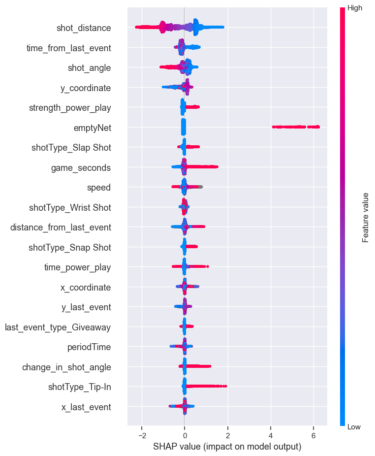
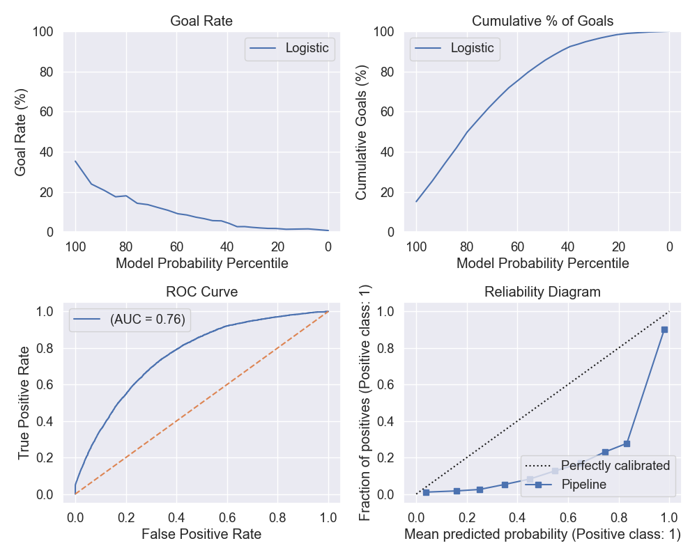
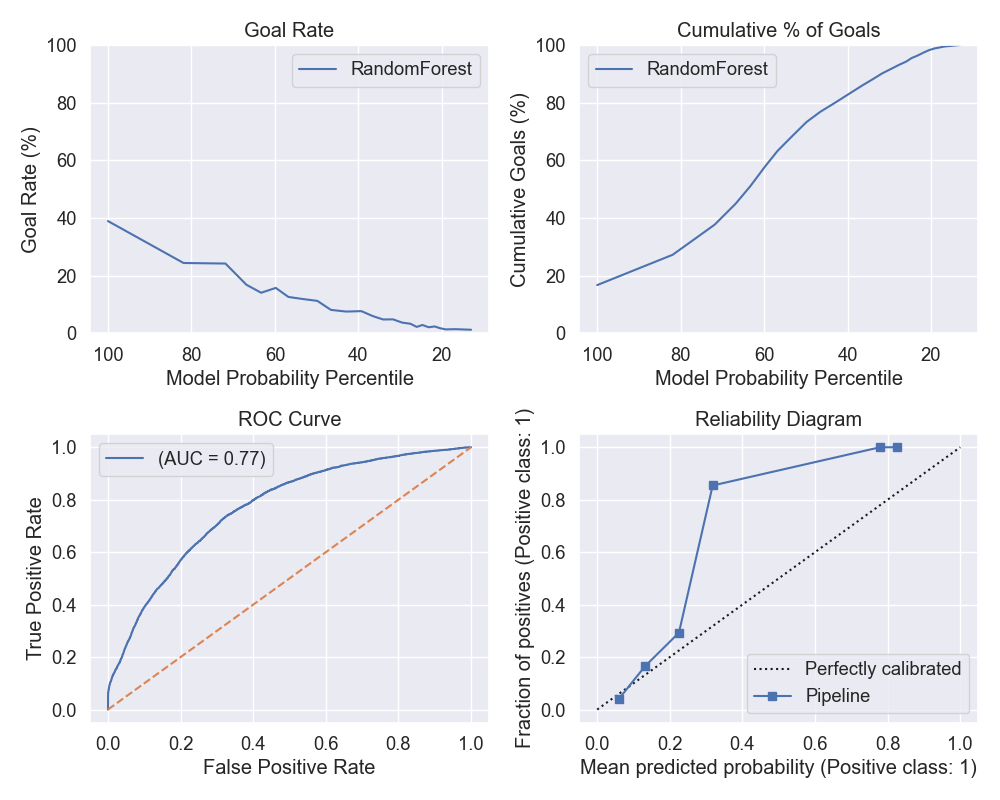
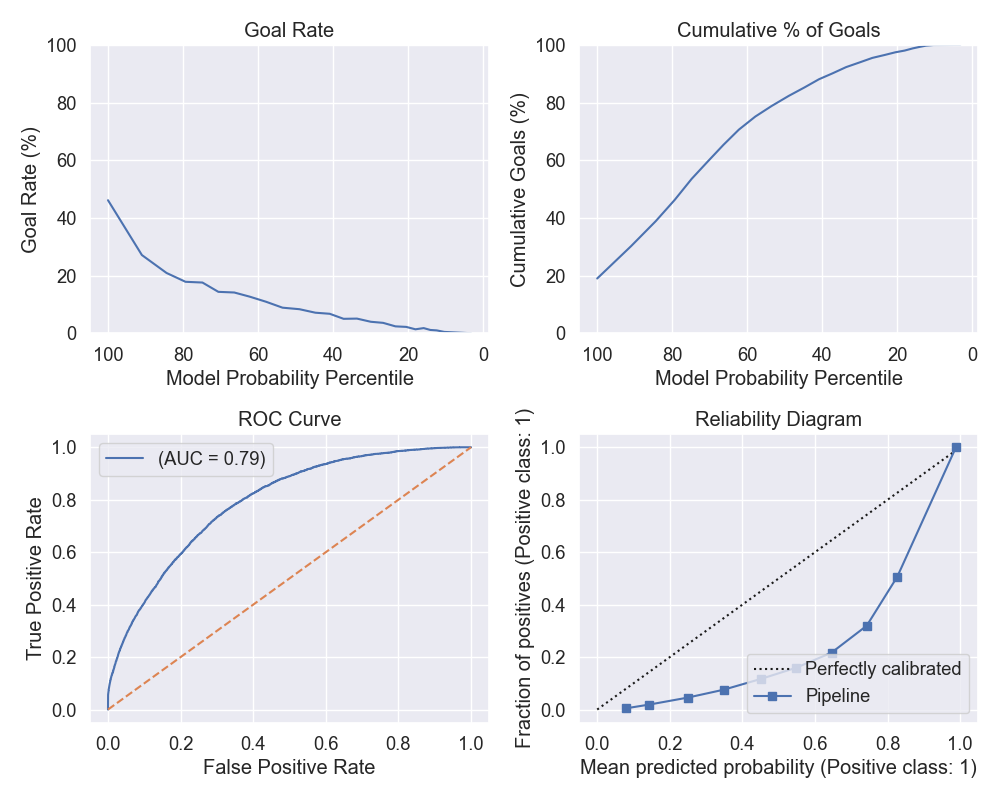
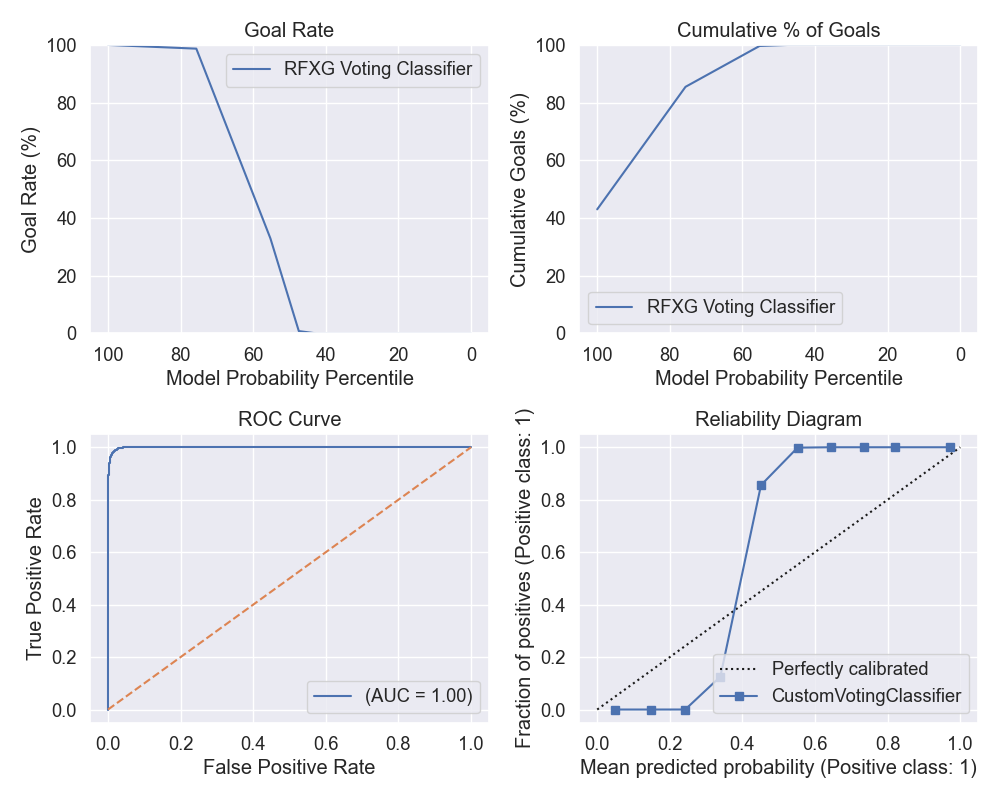
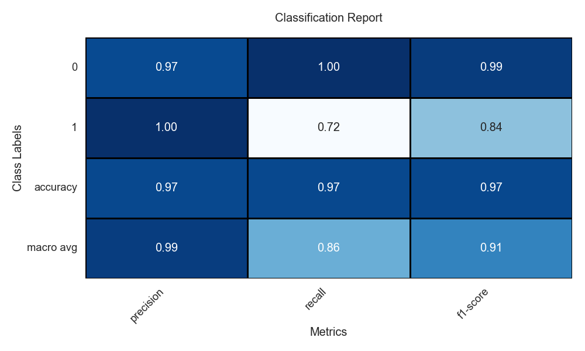
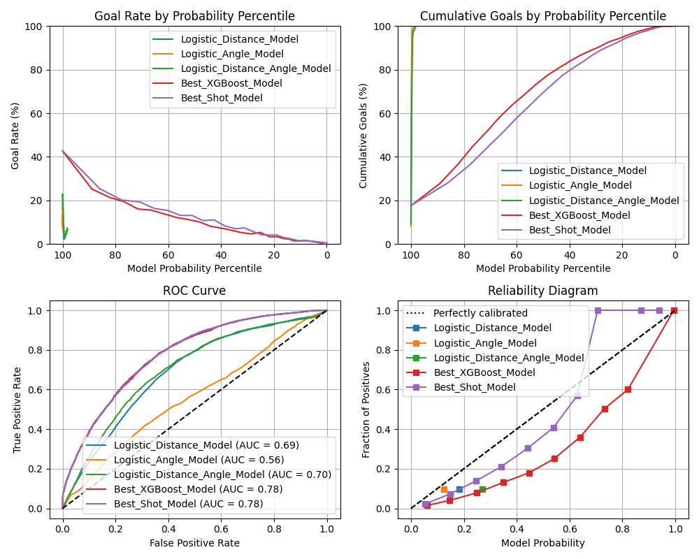
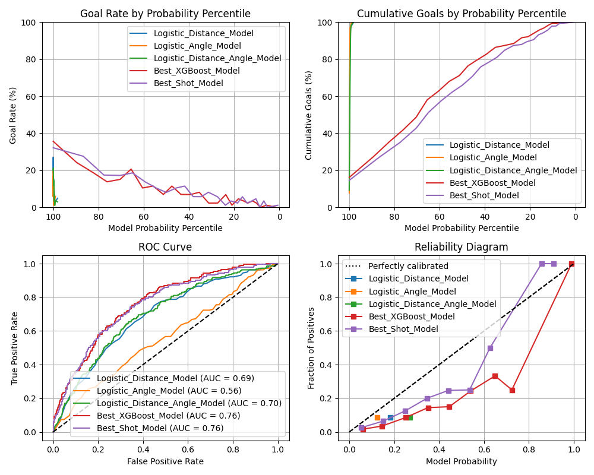

# Experiment Tracking with Comet.ml

## Introduction to Experiment Tracking

Experiment tracking is a fundamental aspect of machine learning projects, allowing data scientists to log, monitor, and compare different models and their performance. [Comet.ml](https://www.comet.ml) is a powerful tool that provides a seamless experience for this purpose.

## Setting Up Comet.ml

To begin with Comet.ml, sign up and create an account. After setting up your project, you can start tracking experiments with a simple script:


```python
from comet_ml import Experiment
experiment = Experiment(
    api_key="your-api-key",
    project_name="your-project-name",
    workspace="your-workspace"
)
```

## Organizing Experiments
A well-organized workflow is key to managing experiments. Comet.ml offers an intuitive interface to categorize and filter experiments:

## Avoiding Jupyter Notebooks for Experiments
While Jupyter Notebooks are great for exploration, they are not ideal for running reproducible experiments. Python scripts are preferred, and Comet.ml integrates more effectively with them.

## Tracking Experiments
Logging experiments is straightforward in Comet.ml. Here is how you log metrics and parameters:

```python
# Log metrics and parameters
experiment.log_metric("accuracy", accuracy_score)
experiment.log_parameter("regularization_rate", 0.01)
```

## Reproducibility
Comet.ml shines when it comes to reproducibility, providing all the necessary details to recreate experiments, ensuring that models are not just effective but also transparent.

## References
[Comet ml Documentation](https://www.comet.ml/docs/) <br>
[Saving Scikit-Learn Models](https://scikit-learn.org/stable/modules/model_persistence.html) <br>
[Saving XGBoost Models](https://xgboost.readthedocs.io/en/latest/python/python_intro.html#model-saving-and-loading) <br>

## **Task 2 - Feature Engineering I**

### Question 1

After preparing the tidy dataset to include details about all shots and goals, we introduced several new attributes, including "shot distance," "shot angle," "goal status," and "empty net." With this additional information, we were able to create the following visualizations:

**Shot counts by distance**


As depicted in the figure above, it is clear that the majority of shots and goals were attempted from distances ranging between 5 to 70 feet, which aligns with our expectations. The greatest concentration of both shots and goals occurred at a distance of approximately 15 feet. In contrast, very few shots were taken from the defensive side of each team, where the distance exceeded 100 feet.

**Shot counts by angle**


The shot count histogram, categorized by shot angle, reveals that hockey players tend to favor shots from the front (with angles ranging from 0 to 45 degrees) over shots from the sides with wider angles. This preference is reasonable, as taking a shot with a very wide angle increases the likelihood of missing the target.

It's worth noting that there were instances where shot angles exceeded 90 degrees. This indicates that hockey players attempted shots from behind the net, which is quite remarkable!

**Shot by both distance and angle from the net**


By considering both shot distance and shot angle together, we can make the following observations:

- Shots with angles exceeding 90 degrees are consistently taken close to the net. This is evident because the maximum distance behind the net is approximately 25 feet. This finding reinforces the appropriateness of our feature engineering process.

- Shots taken from a significant distance are consistently launched at angles ranging from 0 to 25 degrees. This aligns with expectations, as taking a shot very close to the net with a steep angle would greatly increase the chances of the shot hitting the goal post.

### Question 2

In this section, we explore the relationship between the goal rate and two key features: shot distance and shot angle:


- The first chart illustrates that as shots get closer to the target, their likelihood of becoming a goal increases. However, there's an interesting observation where shots from distances greater than 160 feet exhibit a notably higher goal rate compared to those in the 40 to 80 feet range. This might be due to the limited number of shots taken from these extremely long distances, making the goal rate for far-distance shots less reliable.

- The second chart also highlights the challenges of using goal rate as an evaluation metric for hockey shots. For instance, there is only one shot with a 100-degree angle, and it happened to be a goal. This results in a 100% goal rate for the 100-degree shots, which is not a sensible representation. In my opinion, one way to address this issue is to weight the goal rate by a coefficient that is inversely proportional to the shot counts, making the "goal rate" feature more informative and robust.

### Question 3

In this part, we attempt to identify potential errors within the dataset. In particular, we have an intuitive understanding that **it is an extremely rare occurrence to score a non-empty net goal against the opposing team from your defensive zone**. To verify our expectations, we have generated figure depicting shots taken with an empty net and shots taken without an empty net. 

Our intention is to scrutinize the presence of far-distance shots taken without an empty net and investigate the underlying reasons if such shots are observed.


The figure above clearly indicates the existence of shots within the range we described (between 150 to 170 feet) when the net was not empty.

Upon examining the processed dataset, we have identified incorrect or inaccurate data.


As an example, consider the shot taken at 10:27 during the second period of the game between FLA and DET on December 24, 2016, which was recorded with incorrect coordinates and can be seen in the above figure (highlighted in white).

Upon closer inspection of the dataframe, it is apparent that the recorded shot coordinates are [-97, 21], while the side of the net being shot at is on the right, which should correspond to coordinates [89, 0]. This erroneous recording has led to an inaccurate calculation of the shot distance (187 feet), whereas the actual distance is very close to the net. In reality, the correct coordinates for this shot were [97, -21].

Further investigation into similar shots has confirmed that the recorded coordinates are incorrect for all of these cases.


#  Baseline Model 

## Question 1 

<table>
  <tr>
    <td>
      
      <br>
      <em>Figure 3: Confusion Matrix for Baseline Logistic Regression on distance feature</em>
    </td>
    <td>
      
      <br>
      <em>Figure 4: Classification report for Baseline Logistic Regression on distance feature</em>
    </td>
  </tr>
</table>

[Comet Experiment for Baseline Question 1](https://www.comet.com/2nd-milestone/baseline-model/44e0b40478234797adcdc68fa11d8c50?experiment-tab=images)

[Comet Experiment for Baseline Question 2](https://www.comet.com/2nd-milestone/baseline-model/e4f54d90a4044c57ba30e1930e97c5c0?experiment-tab=images)

The accuracy for the baseline model `LogisticClassifier` using only `shot_distance` is `90.3%`. However, further analysis as shown in `classification_report` reveals that the model is predicting `not_goal` label for every goal given as input. This is also apparent in the `percision` and `recall` for `is_goal` label which is zero. 

Looking more deeply at the dataset shows that this data is higly unbalanced. As can be seen in the following graph, only a small portion of the data (less than 10%) are the shots that actually led to goals. Therefore, the model predicts every shot to be shot rather than a goal when it is actually a goal. 


This calls for a better treatment of imbalanced class either by using advanced models or by data augmentation. Following URL consists of the details of the experiment ran.

[Comet Experiment Link](https://www.comet.com/2nd-milestone/baseline-model/44e0b40478234797adcdc68fa11d8c50?experiment-tab=panels&showOutliers=true&smoothing=0&xAxis=wall)


## Question 3 

[Comet Experiment for Baseline Question 3](https://www.comet.com/2nd-milestone/baseline-model/52edc2c0320f42b8810bcbb28b4d7448?experiment-tab=images)

### Goal rate as a function of Model probability percentile 
This figure considers the true goal rate in the validation set binned by the models's probability percentile equal cut. 

So all the results for all features suggest that the actual observed rate of achieving the goal is low when the model predicted probabilities are within $[0, 22]$. We can see the probabilites which to true values among these three are coming from the model trained on all features; `shot_distance` and `shot_angle`. 
The random model is a horizontal line accross are bins which suggest that it does not align within and care to the actual data probabilty.

### Cumulative Goals as a function of Model probability percentile 
Ideally, if the slope of the model is 0, it means the model assigns high probabilities to a larger proportion of the actual positive outcomes, which is desirable. However, it can be counter-intuitive argument towards overfitting.

By cumulating the goals according to the percentiles of probability, we can observe of how much of the goals are explained by the model, and how confident it is. The random model is a diagonal line which suggests that it does not align within and care to the actual data probabilty.

The slope of this plot indicates how much of the goals are captured within a range of best percentiles of goal probabilities. A flat slope indicates there are very few goals explained by the range of probabilities, such that a prediction within the 40% lowest probabilities of the `Angle Model` indicates a low chance of goal.
A high slope indicates many goals are being captured by the range of probabilities, such that a prediction within the 20% highest probabilities of the `Angle Model` and  `Distance Model` indicates a high chance of goal.

When we consider the Random model, although the slope is steady and constant but the values it ascertains are very low. This is because the model is not able to capture the actual data probabilty. The top 20%ile explains as much as top 80%ile.

### ROC curve
The ROC curve shows the True positive rate $\frac{TP}{TP + FN}$ and False positive rate $\frac{FP}{FP+TN}$. A model that has 0 slope or AUC of 1 is the ideal model that explained the true probabilities perfectly. This curve evaluate the performance of a binary classification model across various thresholds, and provides a measure of specificity and sensitivity. The random classifier being a diagonal line aligns with our prediction. We can see that the `shot_angle` feature has lowest performance among other features. This also shows itself in the curve associated with the both features. We can see that the curve of both features is very close to the curve with only `shot_distance` feature indicative of a similar performance. 

### Calibration curve
A perfectly calibrated model would follow the dotted diagonal line, indicating that the predicted probabilities match the observed frequencies. Points or lines below the diagonal indicate overconfidence; points or lines above indicate underconfidence.

The combined features models (`shot_angle` and `shot_distance` ) are very close to the diagonal line. This means that the model is well calibrated. However, it's only able to 
~22% of the positives (goals).

The model trained on `shot_angle` feature is not well calibrated as it explains even less than 20% of the positives (goals).

The Random model explains the constant fraction of positives over it's entire probability range. This is because the model is not able to capture the actual data probabilty.

## **Task 4 - Feature Engineering II**

In this undertaking, we have modified the organized tidy data to incorporate additional essential features with the anticipation of enhancing the performance of machine learning algorithms.

To be precise, the supplementary features are detailed in the table below:

|Column Name   |Description and Explanation   |
|-------|--------------------------------------|
|game_seconds|{::nomarkdown}The timestamp indicating when the shot was executed in seconds{:/}|
|period|{::nomarkdown}The period during which the shot was taken{:/}|
|x_coordinate|{::nomarkdown}x-coordinate of the shot{:/}|
|y_coordinate|{::nomarkdown}y-coordinate of the shot{:/}|
|shot_distance|{::nomarkdown}The shot's distance from the net goal{:/}|
|shot_angle|{::nomarkdown}The degree measure of the angle between the net and the shot{:/}|
|emptyNet|{::nomarkdown}A binary variable that denotes whether the net was unoccupied when the shot was executed{:/}|
|x_last_event|{::nomarkdown}x-coordinate of the previous event{:/}|
|y_last_event|{::nomarkdown}y-coordinate of the previous event{:/}|
|time_from_last_event|{::nomarkdown}The duration of time between the present shot and the preceding event{:/}|
|distance_from_last_event|{::nomarkdown}The measurement, in feet, of the separation between the current shot and the coordinates of the prior event{:/}|
|is_rebound|{::nomarkdown}A boolean variable indicating whether the shot is a rebound{:/}|
|change_in_shot_angle|{::nomarkdown} The difference in angle between two successive shots, measured in degrees. This calculation applies only if the preceding event was a shot or a goal; otherwise, it remains at 0{:/}|
|speed|{::nomarkdown} Calculated as the ratio of the distance from the prior event to the time elapsed since the prior event{:/}|
|time_power_play|{::nomarkdown}A timer that records the duration of the game in a power-play situation{:/}|
|num_player_home|{::nomarkdown}The count of players from the home team present when the shot was executed{:/}|
|num_player_away|{::nomarkdown}The count of players from the away team present when the shot was taken{:/}|

It's important to note that we have already rectified the erroneous coordinate information to obtain this final dataframe.

Regarding rebound shots, we have included shots where the preceding event was either a shot or a **blocked shot**, which deviates slightly from the task's initial suggestion.

Furthermore, we identified numerous instances in which two consecutive shots were separated by a significant time interval, such as 22 seconds. In such cases, we do not consider them as rebounds. Therefore, we define a shot as a rebound only if the time gap between it and the previous shot is less than 4 seconds.

We are supplying a dataframe that encompasses all the game-related information for the matchup between Winnipeg and Washington that took place on March 12, 2018, with a game ID of *2017021065*.

The [dataframe can be accessed here](https://www.comet.com/2nd-milestone/feature-engineering-data/2d7198d091ec403a85e33d3b9cadce18?assetId=16bc437b6fa34861a70713e411b1101a&assetPath=dataframes&experiment-tab=assetStorage)

# Advanced Models

## Question 1
[Comet Experiment](https://www.comet.com/2nd-milestone/advanced-model/de8450185d4a455f975f54b2b2c032ec?experiment-tab=images)


| XGBoost Classifier | Logistic Regression Baseline |
|:------------------:|:----------------------------:|
|  |  |
| *Figure 3: Baseline XGBoost on distance and angle features* | *Figure 4: Baseline Logistic Regression on distance and angle features* |

- **Training and Validation Setup**: The training and validation setup for the XGBoost classifier is the same as the setup for the Logistic Regression baseline. The training set consists of data from 2015-16, 2016-17, 2017-18 and the validation set is the season 2018-2019. Season 2019-2020 has been set aside for the test set to be used in later sections.

- **Comparison to Logistic Regression Baseline**: The XGBoost classifier performs better than the Logistic Regression baseline. 
    - The goal rate versus probability percentile curve for the Baseline XGBoost classifier explains a greater proportion of the goals than the Logistic Regression baseline. It is able to distinguish between the goals and non-goals better even though the explained goals remains almost the same
    - The cumulative goals proportion curve for the Baseline XGBoost classifier is closer to the diagonal line than the Logistic Regression baseline, indicating worse performance on this metric
    - The area under the curve for reciever operating characteristics for XGBoost (0.72) is greater than that of any model of Logistic Regression (max: 0.7), indicating a better performance.
    - The reliability curve for the Baseline XGBoost classifier is able to explain probabilities perfectly till $0.35$ post which it fizzles out, zeroing (counter predicting) post 0.6 probability of goal. On the other hand the best baseline Logistic Regression is only able to explain till $0.22$.

## Question 2
[Comet Experiment](https://www.comet.com/2nd-milestone/advanced-model/6f870834944f47b280fc6b6758973abd?experiment-tab=images)


| XGBoost Tuned | XGBoost Baseline |
|:------------------:|:----------------------------:|
|  |  |
| *Figure 3: Hyperparameter Tuned XGBoost on all features* | *Figure 4: Baseline XGBoost on all features* |

- **Hyperparameter Tuning**: The method involved exploring a range of values for each parameter that influences the model's learning process. We adjusted parameters such as the number of trees, learning rate, tree depth, and others that define the model's complexity and training process. We used Sequential Model-Based Optimization (SMBO) with the Tree Parzen Estimator (TPE), a variant of Bayesian Optimization that looks for the distribution maximizing the evaluation score.
During this optimization phase, we measured the model's performance by calculating the macro-average F1 score. This approach is particularly beneficial when dealing with uneven class distributions. We iterated through 100 different parameter combinations, each time fitting the model, making predictions, and recording the F1 score. The objective was to find the parameter set that maximizes the F1 score, corresponding to the lowest loss in our optimization procedure. The resulting best-performing model parameters will be presented in the blog post, accompanied by visual aids that demonstrate the impact of various hyperparameter values on the model's performance. These visuals will help clarify the tuning process and validate the selection of our final model parameters.

- **Comparison to XGBoost Baseline**:
    - The goal rate versus probability percentile curve for the tuned XGBoost classifier explains a greater proportion of the goals than the XGBoost baseline. It is able to distinguish between the goals and non-goals better even though the explained goals remains almost the same
    - The slope for cumulative goals proportion curve for the tuned XGBoost classifier is closer to the ideal slope of 0 as compared to the XGBoost Baseline indicating better performance on this metric. 
    - The area under the curve for reciever operating characteristics for tuned XGBoost (0.82) is greater than that of the XGBoost baseline (0.72), indicating a better performance.
    - The reliability curve for the tuned XGBoost classifier is able to explain all probabilities. However it's far from the perfectly calibrated. On the other hand, the XGBoost Baseline explains probabilities upto 0.35 but then the results are abysmal. Overall, the tuned model is better calibrated than the baseline model.

## Question 3
[Comet Experiment](https://www.comet.com/2nd-milestone/advanced-model/37c5eb9d5b714833b70322de2ec68f88?experiment-tab=images)


| XGBoost Tuned after Feature Selection| XGBoost Tuned | XGBoost Baseline |
|:------------------:|:----------------------------:| :------------------:|
|  |  |  |
| *Figure 3: Hyperparameter Tuned XGBoost on all features* | *Figure 4: Baseline XGBoost on all features* | *Figure 5: Baseline XGBoost on all features* |

- **Feature Selection**: We used the SHAP library to identify the most important features for our model. SHAP is a game-theoretic approach to explain the output of any machine learning model. SHAP values interpret the impact of having a certain value for a given feature in comparison to the prediction we'd make if that feature took some baseline value. The following are the mean shapley values we got per feature. As an experiment we chose top 10 features for modelling



- **Comparison to other XGBoost Models**: 
    - The goal rate as a function of model probability percentile curve for the tuned XGBoost classifier after feature selection explains a less proportion of the goals than the tuned XGBoost classifier before feature selection. 
    - The slope for cumulative goals proportion curve for the tuned XGBoost classifier after feature selection is almost the same as the tuned XGBoost classifier before feature selection indicating similar performance on this metric.
    - The area under the curve for reciever operating characteristics for tuned XGBoost after feature selection (0.78) is less than that of the tuned XGBoost before feature selection (0.82), indicating a worse performance.
    - The reliability curve for the tuned XGBoost classifier after feature selection is similar to the tuned XGBoost classifier before feature selection. Both are able to explain all probabilities. However, the tuned XGBoost classifier before feature selection tend to be closer than ideal in predicted probabilities closer to 1 indicating a better calibration. 

Overall, Both of the XGBoost models perform better than the XGBoost baseline for the reasons already described.


# Our best shot!

## Attempt 1: Augmenting Data before applying Models

The evident challenge with this clasification task was the imbalance in the data. The number of goals is very small compared to the number of shots. This is a common problem in classification tasks and there are several ways to deal with it.

Our first approach was to use the SMOTE algorithm to oversample the minority class. We tried several classifiers, including Random Forest, Neural Network, XGBoost and Logistic Regression.

In addition, we addressed data imbalance by employing the SMOTE algorithm and fine-tuning hyperparameters for each classifier. For the Neural Network, we varied hidden layers, activation functions, solvers, alpha, and learning rates. The Random Forest's tuning included the number of trees, tree depth, minimum samples for splitting and leaf nodes, and max features. Logistic Regression involved adjusting the regularization strength and solver types. For XGBoost, we explored numerous parameters like the number of trees, learning rate, tree depth, and regularization terms.

Alongside these technical adjustments, we focused on optimizing metrics such as the macro-average F1 score and the F1 score for the minority class to combat the effects of class imbalance in our dataset.

Below are the visualizations for each model:

### Neural Network Performance Plots
[Comet Experiment](https://www.comet.com/2nd-milestone/best-shot-model-mlp/1f3f76df23eb4ab3a3bd67254f184277?experiment-tab=panels&showOutliers=true&smoothing=0&xAxis=wall)




### Random Forest Performance Plots
[Comet Experiment](https://www.comet.com/2nd-milestone/best-shot-model-rf/5256468e47f34db4b85c8459ad30b87a?experiment-tab=panels&showOutliers=true&smoothing=0&xAxis=wall)




### Logistic Regression Performance Plots
[Comet Experiment](https://www.comet.com/2nd-milestone/best-shot-model-logistic/fa0b0b418be84a4d94f39e93d396e7df?experiment-tab=panels&showOutliers=true&smoothing=0&xAxis=wall)


### XGBoost Performance Plots


[Comet Experiment](https://www.comet.com/2nd-milestone/best-shot-model-xgboost-smote/b6970c6eb2e64fab8dd222f44caf2065?experiment-tab=panels&showOutliers=true&smoothing=0&xAxis=wall)





## Attempt 2: A Soft Voting Classifier with XGBoost and Random Forest Classifier

In order to tackle the imbalance problem, we observed that XGBoost struggled with some specific features, while Random Forest Classifier performed better. Therefore, we decided to use a soft voting classifier with XGBoost and Random Forest Classifier. The soft voting classifier takes the average of the predicted probabilities of each model and then predicts the class with the highest probability.







We got the best F1 Macro score using this algorithm and the perfect AUC score of 1.0. However, the calibration curve shows that the model is not well calibrated. We can validate the authenticity of the high scores in the final test data.


# Evaluate on test set

## Question 1 



The figure above shows the performance of the 5 models on the test set, which consisits of the 2019-2020 regular season data. Our best model (the soft voting classifier) did not perform as good on the test set as it did on the validation set. This might be due to our hyperparameter tunning technique consisting of only one validation set, which might have overfitted the model to the validation set. 

 According to the ROC Curve, goal rate and cumulative goals cuve, it behaves similar to the XGBoost baseline model. However, the calibration curve indicates that the "Best Shot Model" is better calibrated for lower probabilities, and the "Best XGBoost Model" appears to be more reliable for higher probabilities and shows more consistent calibration across probabilities.

As for the logisitc models, according to the ROC Curve, the model using distance and angle performs the best, followed by the model using only distance, with the model using only the angle performing the worst in terms of AUC. The choice between the Distance model and the Distance-Angle model would depend on other factors like model complexity, computational efficiency, and the specific use case's requirements. For instance, if the gain in AUC is not substantial and comes at the cost of significantly increased complexity or computation time, one might opt for the simpler model.


## Question 2



The figure above shows the performance of the 5 models on the test set, which consisits of the 2019-2020 playoffs data.
A first observation we can make by comparing the plots with the regular season test set is the irregularity in the curves. This could be due to the fact that the playoffs data is much smaller than the regular season data, and therefore the curves are more sensitive to the data points. Also, the models were trained on regular season data, and therefore might not be as good at predicting the playoffs data.

According to the AUC metric, while the logistic models kept the same performance as on the regular season test set, the XGBoost and the soft voting classifier models performed slightly worse. This could indicate that the distance and angle features are robust features througout the whole season.

An interesing observation is how the soft voting classifier is more now more reliable than the XGBoost model throughout the whole probability range. This could be due to the fact that the XGBoost model is more sensitive to the data points, and therefore the playoffs data points might have affected the model's calibration.

