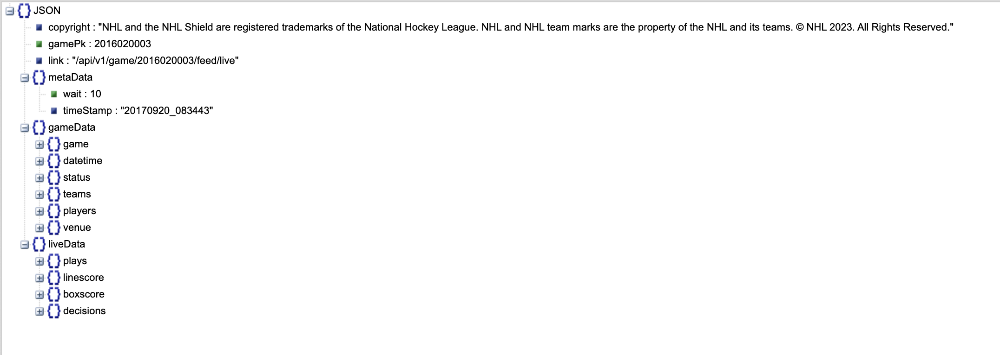

### Task 1 - Data Acquisition

**Download NHL Data**

In this project, we are given NHL Hockey dataset. The original curated dataset can be accessed through REST API endpoint: https://statsapi.web.nhl.com/api/v1/game/[GAME_ID]/feed/live/. Moreover, 
`GAME_ID` is of `10` digits long. The first 4 represent game's season (e.g. 2017, 2019), the next 2 represent the type of game played (01 = preseason, 02 = regular season, 03 = playoffs, 04 = all-star), and the remaining 4 allude a particular season game.

Given dataset also comprises two game types, i.e. regular and playoff games, which have the following dataset characteristics:
(i) regular seasons: the last 4 digits of `GAME_ID` ranges from 0001 to 1270, which is merely applicable to those seasons with 31 teams, and varies between 0001 and 1230 for those with 30 teams;
(ii) playoff games: the last three digits of `GAME_ID` represent the round, matchup, and game number, respectively.

To acquire (download) the given dataset, we create a class `downloadData` that has two monumental modules:

(a) `download_nhl_raw_data` is responsible to download all the NHL data in accordance with a selected season (or year), given the parent directory path `data_dir_path`. The class `downloadData` receives the user inputs and sets its attributes inside its `constructor` as follows:

```python
class downloadData:
    r"""
    Class to download NHL Hockey Data
    """

    def __init__(self, target_year: str, data_dir_path: str) -> None:
        r"""
        Args:
            target_year (str): The year that we want to get data
            data_dir_path (str): Path to the directory we want to store data (not including year)
        """

        self.target_year = target_year
        self.data_dir_path = data_dir_path
```

Owing to the limitation of data for avaialble seasons, the implemented approach lets the user to download data for five consective seasons, i.e. from 2016-17 to 2020-21.

```python
	def download_nhl_raw_data(self) -> None:
		r"""
		Function to extract NHL games' data for a specific year
		"""

		accessible_years = ['2016', '2017', '2018', '2019', '2020', '2021']
		
		if(self.target_year not in accessible_years):
			print("Dataset does not contain the entered year")
```

Here, the user-selected year is being matched with the available years for validity. Once the year's validity has been confirmed, we initialize paths for the two given game types with the arguments provided, following which essential directories are created in case they do not exist already.

```python
		# Initializing regular and playoff settings' path
		regular_dir_path = os.path.join(self.data_dir_path, self.target_year, 'regular_games')
		playoff_dir_path = os.path.join(self.data_dir_path, self.target_year, 'playoff_games')

		# Sanity check for directories's existence
		if not os.path.exists(regular_dir_path):
			os.makedirs(regular_dir_path)
		if not os.path.exists(playoff_dir_path):
			os.makedirs(playoff_dir_path)
```

The following snippet is to download all the relevant data files for `regular` game type for the user-provided target year (season):

```python
		# Download data of regular games for the selected year
		print(f'Downloading regular games data for {self.target_year}...')

		# Year 2016 has 1230 games, while the remaining available years have data of 1270 games
		ID_range = 1231 if (self.target_year=='2016') else 1271

		for ID in tqdm(range(1, ID_range)):
			# Convert ID from integer to string
			ID_str =  "0" * (4 - len(str(ID))) + str(ID)
			regular_game_id = self.target_year + "02" + ID_str
			
			# Download data of each game
			self.download_nhl_data(regular_dir_path, regular_game_id)
```

It is worth mentioning that for 2016, we have 30 teams with total of 1230 games, whereas for each season following 2016, total of 1270 games were played with engagement of 31 teams.

```python
		# Download data of playoff games for the selected year
		print(f"Downloading playoff games data for {self.target_year}...")

		for round in tqdm(range(1, 5)):
			# `round 1` comprises `8` game matchups, `round 2` has game matchups of `4` and so on
			matchups = int(2**(3 - round))
			for matchup_number in range(1, matchups + 1):
				# Each match up has 7 games in total
				for game_id in range(1, 8):
					playoff_game_id = self.target_year + "030" + str(round) + str(matchup_number) + str(game_id)
					self.download_nhl_data(playoff_dir_path, playoff_game_id)
```				

(b) We also create a utility function named `download_nhl_data`	that is responsible for downloading a specific game's data from the provided NHL Data API given `NHL Game ID`.

```python
	def download_nhl_data(self, path: str, nhl_game_id: str) -> None:
		r"""
        Download NHL play-by-play data of a specific game into a particular directory path

        Args:
            path: Path to the directory
            nhl_game_id: Game ID of the NHL game that we want to download the data of
        """

		file_path = os.path.join(path, nhl_game_id + ".json")
		
		# Return if file path already exists
		if(os.path.exists(file_path)):
				return
			
		try:
			# Read NHL play-by-play data for both regular season and playoffs game settings
			with urllib.request.urlopen("https://statsapi.web.nhl.com/api/v1/game/" + nhl_game_id + "/feed/live/") as url:
				data = json.load(url)
				if ("messageNumber" in data and "message" in data 
					and data["messageNumber"] == 2 and data["message"] == "Game data couldn't be found"):
					pass
				else:
					with open(file_path, 'w') as outfile:
						json.dump(data, outfile)
		except HTTPError as he:
			print(nhl_game_id)
			print(he.reason)
		except Exception:
			print('nhl_game_id: '+str(nhl_game_id))
			e_type, e_value, e_traceback = sys.exc_info()
			print(e_value)		
```
				
Voila!! All the necessary functions that could aid in downloading and structuring the NHL data have been prepared. Running the following short code snippet will collect and arrange the data of all seasons (starting 2016 to 2021) to the parent folder "/data/raw_data":

```python
download_path = os.path.join("data", "raw_data")
available_years = ['2016', '2017', '2018', '2019', '2020', '2021']
for year in available_years:
	obj = downloadData(year, download_path)
    obj.download_nhl_raw_data()
```				

The above snippet can be run for any number of times. Note that running the above snippet only download the missing data files and skip the existing data files upon its multiple executions to ensure having all data downloaded and arranged properly using NHL Stats API.

It's worth noticing that since we have two game types (`regular` and `playoff`) for each season, te above code snippet upon execution results in the following data directory structure:

```python
-- /data/raw
    -- 2016
    -- 2017
    -- 2018
    -- 2019
        -- playoff_games
            -- [gameId1].json
            -- [gameId2].json
        -- regular_games
            -- [gameId3].json
            -- [gameId4].json
    -- 2020
	-- 2021
```

### Task 2 - Tidy Data
The data is ditributed in a JSON format. It is divided first by season and in each season a json file represents a single game. The nomenclature of the file suggest the naming convention being "season-date-match#" where the match# is the number of the game in the season. The data is not tidy as it is not in a tabular format. The data is nested and the columns are not independent of each other. The schema of the json files looks something like this for all files:




Hence, we need to tidy the data. In order to future proof our data engineering work, we have used Apache Spark to load the json corpus and build RDD DataFrames. We have used the following schema to load the data:


```python
allplay = json_compiled.select(F.col("gamePk").alias('game_id'),
                           F.col("gameData.game.season").alias("season"),
                            F.col("gameData.game.type").alias("game_type"),
                            F.col("gameData.datetime.dateTime").alias("start_time"),
                            F.col("gameData.datetime.endDateTime").alias("end_time"),
                            F.col("gameData.teams.away.id").alias("away_team_id"),
                            F.col("gameData.teams.away.name").alias("away_team_name"),
                            F.col("gameData.teams.home.id").alias("home_team_id"),
                            F.col("gameData.teams.home.name").alias("home_team_name"),
                            F.explode(F.col("liveData.plays.allplays")).alias("allplays") # Explode the allplays column since it is a list
                                        )
```

The above schema is used to expand the struct data structure of the Spark DataFrame. The schema is used to extract the following columns from the json corpus:

1. game_id: The unique identifier of the game
2. season: The season of the game
3. game_type: The type of the game (regular or playoff)
4. start_time: The start time of the game
5. end_time: The end time of the game
6. away_team_id: The unique identifier of the away team
7. away_team_name: The name of the away team
8. home_team_id: The unique identifier of the home team
9. home_team_name: The name of the home team
10. allplays: Live data information as the game progresses

For the sake of Milestone 1 we are required to only focus on "Shot" and Goal" events. So, filtering the entire data set to focus on just these two events.

```python
allplay = allplay.filter((F.col("allplays.result.eventTypeId") == "SHOT") | (F.col("allplays.result.eventTypeId") == "GOAL"))
```

Now, expanding the live data:

```python
allplayDF = allplay.select(F.col("game_id"),
                           F.col("season").alias("season"),
                            F.col("game_type").alias("game_type"),
                            F.col("start_time").alias("start_time"),
                            F.col("end_time").alias("end_time"),
                            F.col("away_team_id").alias("away_team_id"),
                            F.col("away_team_name").alias("away_team_name"),
                            F.col("home_team_id").alias("home_team_id"),
                            F.col("home_team_name").alias("home_team_name"),
                            F.col("allplays.about.eventIdx").alias("eventIdx"),
                           F.col("allplays.result.event").alias("event"),
                           F.col("allplays.result.description").alias("description"),
                           F.col("allplays.result.secondaryType").alias("shotType"),
                           F.col("allplays.result.strength.code").alias("strength"),
                           F.col("allplays.result.gameWinningGoal").alias("gameWinningGoal"),
                           F.col("allplays.result.emptyNet").alias("emptyNet"),
                            F.col("allplays.result.penaltySeverity").alias("penaltySeverity"),
                            F.col("allplays.result.penaltyMinutes").alias("penaltyMinutes"),
                            F.col("allplays.coordinates.x").alias("x_coordinate"),
                            F.col("allplays.coordinates.y").alias("y_coordinate"),
                            F.col("allplays.team.name").alias("team_name"),
                            F.col("allplays.about.period").alias("period"),
                            F.col("allplays.about.periodType").alias("periodType"),
                            F.col("allplays.about.periodTime").alias("periodTime"),
                            F.col("allplays.about.periodTimeRemaining").alias("periodTimeRemaining"),
                            F.when(F.col("allplays.result.event")=="Goal",1).otherwise(0).alias("is_goal"),
                            F.explode(F.col("allplays.players")).alias("players") # Explode the players column since it is a list of Goalie, Shooter, Assist, and Scorer
                            )
```

The above schema is used to extract the following columns from livedata important for statistical modelling from the json corpus:

1. shotType: The type of the shot (Wrist, Slap, Snap, Tip-In, Deflected, Wrap-around, Backhand, Penalty, Unknown)
2. strength: The strength of the team (Even, Power Play, Short Handed, Penalty Shot)
3. gameWinningGoal: Whether the goal was a game winning goal or not
4. emptyNet: Whether the goal was an empty net goal or not
5. penaltySeverity: The severity of the penalty (Minor, Major, Misconduct, Match)
6. penaltyMinutes: The number of penalty minutes
7. x_coordinate: The x coordinate of the shot
8. y_coordinate: The y coordinate of the shot
9. team_name: The name of the team who made the shot
10. period: The period of the game
11. periodType: The type of the period (Regulation, Overtime, Shootout)
12. periodTime: The time of the period
13. periodTimeRemaining: The time remaining in the period
14. is_goal: Whether the shot was a goal or not
15. players: The players involved in the shot (Goalie, Shooter, Assist, and Scorer)

With Apache Spark in the data processing pipeline 
1. We can easily scale and parallelize the data processing pipeline to handle large data with many more features and seasons with minimal bump in time complexity whereas Pandas/loops would have been a bottleneck.
2. Code is readable and easy to understand and maintain. 
3. A bottleneck however exists in the size of the Spark module. To overcome this we can ship the new version in Arrow which is a lighter sibling of Spark and is faster than Pandas.

Joining all the dataframes gives us the attributed required for the statistical modelling required in further questions. The snapshot of the final table looks like this:

| game_id   | period | eventIdx | season   | game_type | start_time              | end_time                | away_team_id | away_team_name       | home_team_id | home_team_name      | event | shotType    | strength | gameWinningGoal | emptyNet | penaltySeverity | penaltyMinutes | x_coordinate | y_coordinate | team_name           | periodType | periodTime | periodTimeRemaining | is_goal | Assist_first   | Assist_last    | Scorer            | Goalie          | Shooter           | home_rinkSide | away_rinkSide | rinkSide | x_goal | y_goal | shot_distance |
|-----------|--------|----------|----------|-----------|-------------------------|-------------------------|-------------|----------------------|-------------|---------------------|-------|-------------|----------|-----------------|----------|-----------------|----------------|--------------|--------------|-------------------|------------|------------|-------------------|---------|----------------|----------------|-------------------|-----------------|-------------------|---------------|---------------|----------|--------|--------|---------------|
| 2016020001 | 2      | 174      | 20162017 | R         | 2016-10-12T23:00:00Z | 2016-10-13T01:56:40Z | 10          | Toronto Maple Leafs | 9           | Ottawa Senators     | Shot  | Wrist Shot  |          |                 |          |                 |                | 45.0         | -22.0        | Toronto Maple Leafs | REGULAR    | 08:39      | 11:21             | 0       |                |                | Craig Anderson     | William Nylander | right         | left          | left     | 89     | 0      | 49.193495504995376 |
| 2016020001 | 2      | 213      | 20162017 | R         | 2016-10-12T23:00:00Z | 2016-10-13T01:56:40Z | 10          | Toronto Maple Leafs | 9           | Ottawa Senators     | Shot  | Wrist Shot  |          |                 |          |                 |                | 32.0         | -31.0        | Toronto Maple Leafs | REGULAR    | 15:19      | 04:41             | 0       |                |                | Craig Anderson     | Nikita Zaitsev   | right         | left          | left     | 89     | 0      | 64.88451279003334 |
| 2016020001 | 2      | 228      | 20162017 | R         | 2016-10-12T23:00:00Z | 2016-10-13T01:56:40Z | 10          | Toronto Maple Leafs | 9           | Ottawa Senators     | Shot  | Snap Shot   |          |                 |          |                 |                | 57.0         | 9.0          | Toronto Maple Leafs | REGULAR    | 17:41      | 02:19             | 0       |                |                | Craig Anderson     | James van Riemsdyk | right         | left          | left     | 89     | 0      | 33.24154027718932 |
| 2016020001 | 2      | 239      | 20162017 | R         | 2016-10-12T23:00:00Z | 2016-10-13T01:56:40Z | 10          | Toronto Maple Leafs | 9           | Ottawa Senators     | Goal  | Wrist Shot  | EVEN     | False           | False    |                 |                | 81.0         | 4.0          | Toronto Maple Leafs | REGULAR    | 19:57      | 00:03             | 1       | William Nylander | Jake Gardiner   | Auston Matthews   | Craig Anderson   |                | right         | left          | left     | 89     | 0      | 8.94427190999916 |
| 2016020001 | 3      | 301      | 20162017 | R         | 2016-10-12T23:00:00Z | 2016-10-13T01:56:40Z | 10          | Toronto Maple Leafs | 9           | Ottawa Senators     | Shot  | Wrist Shot  |          |                 |          |                 |                | -32.0        | 5.0          | Toronto Maple Leafs | REGULAR    | 09:40      | 10:20             | 0       |                |                | Craig Anderson     | Morgan Rielly    | left         | right         | right    | -89    | 0      | 57.21887800367987 |
| 2016020001 | 3      | 324      | 20162017 | R         | 2016-10-12T23:00:00Z | 2016-10-13T01:56:40Z | 10          | Toronto Maple Leafs | 9           | Ottawa Senators     | Shot  | Wrist Shot  |          |                 |          |                 |                | -49.0        | 11.0         | Toronto Maple Leafs | REGULAR    | 15:43      | 04:17             | 0       |                |                | Craig Anderson     | Milan Michalek    | left         | right         | right    | -89    | 0      | 41.48493702538308 |
| 2016020001 | 3      | 343      | 20162017 | R         | 2016-10-12T23:00:00Z | 2016-10-13T01:56:40Z | 10          | Toronto Maple Leafs | 9           | Ottawa Senators     | Shot  | Slap Shot   |          |                 |          |                 |                | 35.0         | 36.0         | Ottawa Senators     | REGULAR    | 17:59      | 02:01             | 0       |                |                | Frederik Andersen | Marc Methot      | left         | right         | left     | 89     | 0      | 64.89992295835181 |
| 2016020002 | 1      | 37       | 20162017 | R         | 2016-10-13T00:00:00Z | 2016-10-13T02:41:18Z | 19          | St. Louis Blues      | 16          | Chicago Blackhawks  | Shot  | Slap Shot   |          |                 |          |                 |                | 74.0         | -34.0        | St. Louis Blues      | REGULAR    | 05:25      | 14:35             | 0       |                |                | Corey Crawford     | Alex Pietrangelo  | right         | left          | left     | 89     | 0      | 37.16180835212409 |
| 2016020002 | 2      | 134      | 20162017 | R         | 2016-10-13T00:00:00Z | 2016-10-13T02:41:18Z | 19          | St. Louis Blues      | 16          | Chicago Blackhawks  | Shot  | Slap Shot   |          |                 |          |                 |                | -49.0        | -23.0        | St. Louis Blues      | REGULAR    | 04:02      | 15:58             | 0       |                |                | Corey Crawford     | David Perron      | left         | right         | right    | -89    | 0      | 46.14108798023731 |
| 2016020002 | 2      | 209      | 20162017 | R         | 2016-10-13T00:00:00Z | 2016-10-13T02:41:18Z | 19          | St. Louis Blues      | 16          | Chicago Blackhawks  | Shot  | Wrist Shot  |          |                 |          |                 |                | -43.0        | -4.0         | St. Louis Blues      | REGULAR    | 19:20      | 00:40             | 0       |                |                | Corey Crawford     | Vladimir Tarasenko | left         | right         | right    | -89    | 0      | 46.17358552246078 |


