## Task 1 - Data Acquisition

**Download NHL Data**

In this project, we are given NHL Hockey dataset. The original curated dataset can be accessed through REST API endpoint: https://statsapi.web.nhl.com/api/v1/game/[GAME_ID]/feed/live/. Moreover, 
`GAME_ID` is of `10` digits long. The first 4 represent game's season (e.g. 2017, 2019), the next 2 represent the type of game played (01 = preseason, 02 = regular season, 03 = playoffs, 04 = all-star), and the remaining 4 allude a particular season game.

Given dataset also comprises two game types, i.e. regular and playoff games, which have the following dataset characteristics:
(i) regular seasons: the last 4 digits of `GAME_ID` ranges from 0001 to 1270, which is merely applicable to those seasons with 31 teams, and varies between 0001 and 1230 for those with 30 teams;
(ii) playoff games: the last three digits of `GAME_ID` represent the round, matchup, and game number, respectively.

To acquire (download) the given dataset, we create a class `downloadData` that has two monumental modules:

(a) `download_nhl_raw_data` is responsible to download all the NHL data in accordance with a selected season (or year), given the parent directory path `data_dir_path`. The class `downloadData` receives the user inputs and sets its attributes inside its `constructor` as follows:

```python
class downloadData:
    r"""
    Class to download NHL Hockey Data
    """

    def __init__(self, target_year: str, data_dir_path: str) -> None:
        r"""
        Args:
            target_year (str): The year that we want to get data
            data_dir_path (str): Path to the directory we want to store data (not including year)
        """

        self.target_year = target_year
        self.data_dir_path = data_dir_path
```

Owing to the limitation of data for avaialble seasons, the implemented approach lets the user to download data for five consective seasons, i.e. from 2016-17 to 2020-21.

```python
	def download_nhl_raw_data(self) -> None:
		r"""
		Function to extract NHL games' data for a specific year
		"""

		accessible_years = ['2016', '2017', '2018', '2019', '2020', '2021']
		
		if(self.target_year not in accessible_years):
			print("Dataset does not contain the entered year")
```

Here, the user-selected year is being matched with the available years for validity. Once the year's validity has been confirmed, we initialize paths for the two given game types with the arguments provided, following which essential directories are created in case they do not exist already.

```python
		# Initializing regular and playoff settings' path
		regular_dir_path = os.path.join(self.data_dir_path, self.target_year, 'regular_games')
		playoff_dir_path = os.path.join(self.data_dir_path, self.target_year, 'playoff_games')

		# Sanity check for directories's existence
		if not os.path.exists(regular_dir_path):
			os.makedirs(regular_dir_path)
		if not os.path.exists(playoff_dir_path):
			os.makedirs(playoff_dir_path)
```

The following snippet is to download all the relevant data files for `regular` game type for the user-provided target year (season):

```python
		# Download data of regular games for the selected year
		print(f'Downloading regular games data for {self.target_year}...')

		# Year 2016 has 1230 games, while the remaining available years have data of 1270 games
		ID_range = 1231 if (self.target_year=='2016') else 1271

		for ID in tqdm(range(1, ID_range)):
			# Convert ID from integer to string
			ID_str =  "0" * (4 - len(str(ID))) + str(ID)
			regular_game_id = self.target_year + "02" + ID_str
			
			# Download data of each game
			self.download_nhl_data(regular_dir_path, regular_game_id)
```

It is worth mentioning that for 2016, we have 30 teams with total of 1230 games, whereas for each season following 2016, total of 1270 games were played with engagement of 31 teams.

```python
		# Download data of playoff games for the selected year
		print(f"Downloading playoff games data for {self.target_year}...")

		for round in tqdm(range(1, 5)):
			# `round 1` comprises `8` game matchups, `round 2` has game matchups of `4` and so on
			matchups = int(2**(3 - round))
			for matchup_number in range(1, matchups + 1):
				# Each match up has 7 games in total
				for game_id in range(1, 8):
					playoff_game_id = self.target_year + "030" + str(round) + str(matchup_number) + str(game_id)
					self.download_nhl_data(playoff_dir_path, playoff_game_id)
```				

(b) We also create a utility function named `download_nhl_data`	that is responsible for downloading a specific game's data from the provided NHL Data API given `NHL Game ID`.

```python
	def download_nhl_data(self, path: str, nhl_game_id: str) -> None:
		r"""
        Download NHL play-by-play data of a specific game into a particular directory path

        Args:
            path: Path to the directory
            nhl_game_id: Game ID of the NHL game that we want to download the data of
        """

		file_path = os.path.join(path, nhl_game_id + ".json")
		
		# Return if file path already exists
		if(os.path.exists(file_path)):
				return
			
		try:
			# Read NHL play-by-play data for both regular season and playoffs game settings
			with urllib.request.urlopen("https://statsapi.web.nhl.com/api/v1/game/" + nhl_game_id + "/feed/live/") as url:
				data = json.load(url)
				if ("messageNumber" in data and "message" in data 
					and data["messageNumber"] == 2 and data["message"] == "Game data couldn't be found"):
					pass
				else:
					with open(file_path, 'w') as outfile:
						json.dump(data, outfile)
		except HTTPError as he:
			print(nhl_game_id)
			print(he.reason)
		except Exception:
			print('nhl_game_id: '+str(nhl_game_id))
			e_type, e_value, e_traceback = sys.exc_info()
			print(e_value)		
```
				
Voila!! All the necessary functions that could aid in downloading and structuring the NHL data have been prepared. Running the following short code snippet will collect and arrange the data of all seasons (starting 2016 to 2021) to the parent folder "/data/raw_data":

```python
download_path = os.path.join("data", "raw_data")
available_years = ['2016', '2017', '2018', '2019', '2020', '2021']
for year in available_years:
	obj = downloadData(year, download_path)
    obj.download_nhl_raw_data()
```				

The above snippet can be run for any number of times. Note that running the above snippet only download the missing data files and skip the existing data files upon its multiple executions to ensure having all data downloaded and arranged properly using NHL Stats API.

It's worth noticing that since we have two game types (`regular` and `playoff`) for each season, te above code snippet upon execution results in the following data directory structure:

```python
-- /data/raw
    -- 2016
    -- 2017
    -- 2018
    -- 2019
		-- playoff_games
            -- [gameId1].json
            -- [gameId2].json
        -- regular_games
            -- [gameId3].json
            -- [gameId4].json
    -- 2020
	-- 2021
```

## Task 2 - Interactive Debugging Tool

In this task, we delve into NHL data using Interactive Widgets, which enable us to effortlessly switch between Game Types (regular and playoffs) and seasons, as well as view all games. The Interactive Debugging Tool assists us in gaining a deeper understanding of the game data, offering a user-friendly visual representation. For each game, we can sequentially visualize all the event ID's, with events displayed on the ice rink to depict their positions. Additionally, detailed information about the players involved and the specific shot taken. 

Below is the output image generated using the interactive tool that shows the tool's output for the choices: `Game Type` (`regular_season`); `Season` (`2016`); and for `Game ID` (`0001`). It also shows relevant stats for the chosen options.

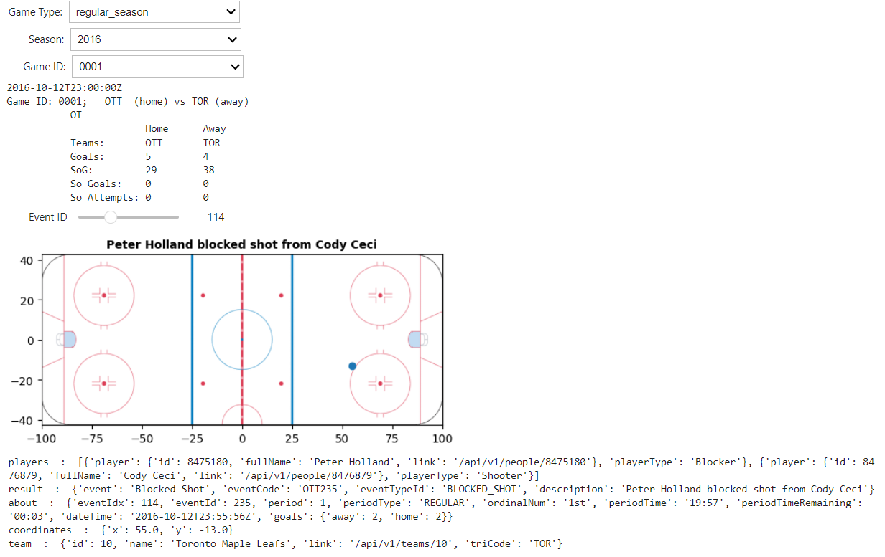

Code written for this tool is given below:
```python
import matplotlib.image as mpimg
import matplotlib.pyplot as plt
import ipywidgets as widgets
import json, os

def interactive_tool(game_type):
    """
    Intractive tool main function
    :param game_type: Dropdown to select either regular or playoff game
    """
    # Path of the directory to collect the data. The data for this functionality coming from the extracted jsons
    path_season = '\\'.join(str(os.getcwd()).split('\\')[:-2])
    path_season = os.path.join(path_season, 'Milestone1')
    file_path_season = os.path.join(path_season, 'data', 'raw_data')
    file_path_season = os.path.join(file_path_season, game_type)
    # load the rink image
    rink_path = os.path.join('\\'.join(str(os.getcwd()).split('\\')[:-1]), 'figures', "nhl_rink.png")
    # List all the seasons
    all_files = os.listdir(file_path_season)

    def get_season_data(input_season):
        """
        Function to get the game season data
        :param input_season: Dropdown to select season of the game
        """
        # Path for the data
        path_season = '\\'.join(str(os.getcwd()).split('\\')[:-2])
        path_season = os.path.join(path_season, 'Milestone1')
        file_path_season = os.path.join(path_season, 'data', 'raw_data')
        file_path_season = os.path.join(file_path_season, game_type, input_season + '\\')
        # creating list of all game IDs
        id_list =[filename[6:10] for filename in os.listdir(file_path_season)]

        def get_game_type_id(game_type_id):
            """
            Function to get the ID of the game type
            :param game_type_id: Dropdown to select the game type
            """
            game_type_id = str(game_type_id).zfill(4)
            for filename in os.listdir(file_path_season):
                if filename.endswith(game_type_id + ".json"):
                    f_path = file_path_season + filename
            with open(f_path, 'r') as f_path:
                game_data = json.load(f_path)

            # Get the associated columns of data from json
            print(game_data['gameData']['datetime']['dateTime'])
            game_home = game_data['gameData']['teams']['home']['abbreviation']
            game_away = game_data['gameData']['teams']['away']['abbreviation']
            game_goals_home = game_data['liveData']['plays']['currentPlay']['about']['goals']['home']
            game_goals_away = game_data['liveData']['plays']['currentPlay']['about']['goals']['away']
            game_sog_home = game_data['liveData']['linescore']['periods'][0]['home']['shotsOnGoal'] + game_data['liveData']['linescore']\['periods'][1]['home']['shotsOnGoal'] + game_data['liveData']['linescore']['periods'][2]['home']['shotsOnGoal']
            game_sog_away = game_data['liveData']['linescore']['periods'][0]['away']['shotsOnGoal'] + game_data['liveData']['linescore']\['periods'][1]['away']['shotsOnGoal'] + game_data['liveData']['linescore']['periods'][2]['away']['shotsOnGoal']
            game_so_goalshome = game_data['liveData']['linescore']['shootoutInfo']['home']['scores']
            game_so_attemptshome = game_data['liveData']['linescore']['shootoutInfo']['home']['attempts']
            game_so_goalsaway = game_data['liveData']['linescore']['shootoutInfo']['away']['scores']
            game_so_attemptsaway = game_data['liveData']['linescore']['shootoutInfo']['away']['attempts']
            print("Game ID: "+ game_type_id +";   " + game_home +"  (home) vs "+ game_away + " (away)")
            print ( "           " + str("OT"))
            print("                        " + "Home" +"      "+ "Away" )
            print("           Teams:       " + game_home +"       "+ game_away)
            print("           Goals:       " + f'{game_goals_home}' +"         "+ f'{game_goals_away}')
            print("           SoG:         " + f'{game_sog_home}' +"        "+ f'{game_sog_away}')
            print("           So Goals:    " + f'{game_so_goalshome}' +  "         "+ f'{game_so_goalsaway}')
            print("           So Attempts: " + f'{game_so_attemptshome}' +  "         "+ f'{game_so_attemptsaway}')

            # Store the data into the variable
            game_data = game_data['liveData']['plays']['allPlays']

            def rink_image(img):
                cor = game_data[img]['coordinates']
                if cor=={}:
                    for key, value in game_data[img].items() :
                        print(key, ' : ', value)
                else:
                    plt.imshow(mpimg.imread(rink_path), extent=[-100., 100. ,-42.5, 42.5])
                    title = game_data[img]["result"]["description"]
                    plt.plot(cor['x'], cor['y'], "o")
                    plt.title(title, fontsize = 10, fontweight ='bold')
                    plt.show()
                    for key, value in game_data[img].items():
                        print(key, ' : ', value)
            # Interactive widget for Event Id
            widgets.interact(rink_image, img = widgets.IntSlider(min=0, max=len(game_data)-1, description="Event ID"))

        # Interactive widget for Game ID
        widgets.interact(get_game_type_id, game_type_id = widgets.Dropdown(
            options=id_list,
            description='Select the Game ID:',
            disabled=False))
    # Interactive widget for Season
    widgets.interact(get_season_data, input_season = widgets.Dropdown(
        options=all_files,
        description='Select the Season:',
        disabled=False))
# List of type
widgets.interact(interactive_tool, game_type = widgets.Dropdown(
    options=['regular_season', 'playoffs'],
    description='Select the Game Type:',
    disabled=False))
```
## Task 4 - Tidy Data
The data is ditributed in a JSON format. It is divided first by season and in each season a json file represents a single game. The nomenclature of the file suggest the naming convention being "season-date-match#" where the match# is the number of the game in the season. The data is not tidy as it is not in a tabular format. The data is nested and the columns are not independent of each other. The schema of the json files looks something like this for all files:


Hence, we need to tidy the data. In order to future proof our data engineering work, we have used Apache Spark to load the json corpus and build RDD DataFrames. We have used the following schema to load the data:


```python
allplay = json_compiled.select(F.col("gamePk").alias('game_id'),
                           F.col("gameData.game.season").alias("season"),
                            F.col("gameData.game.type").alias("game_type"),
                            F.col("gameData.datetime.dateTime").alias("start_time"),
                            F.col("gameData.datetime.endDateTime").alias("end_time"),
                            F.col("gameData.teams.away.id").alias("away_team_id"),
                            F.col("gameData.teams.away.name").alias("away_team_name"),
                            F.col("gameData.teams.home.id").alias("home_team_id"),
                            F.col("gameData.teams.home.name").alias("home_team_name"),
                            F.explode(F.col("liveData.plays.allplays")).alias("allplays") # Explode the allplays column since it is a list
                                        )
```

The above schema is used to expand the struct data structure of the Spark DataFrame. The schema is used to extract the following columns from the json corpus:

1. game_id: The unique identifier of the game
2. season: The season of the game
3. game_type: The type of the game (regular or playoff)
4. start_time: The start time of the game
5. end_time: The end time of the game
6. away_team_id: The unique identifier of the away team
7. away_team_name: The name of the away team
8. home_team_id: The unique identifier of the home team
9. home_team_name: The name of the home team
10. allplays: Live data information as the game progresses

For the sake of Milestone 1 we are required to only focus on "Shot" and Goal" events. So, filtering the entire data set to focus on just these two events.

```python
allplay = allplay.filter((F.col("allplays.result.eventTypeId") == "SHOT") | (F.col("allplays.result.eventTypeId") == "GOAL"))
```

Now, expanding the live data:

```python
allplayDF = allplay.select(F.col("game_id"),
                           F.col("season").alias("season"),
                            F.col("game_type").alias("game_type"),
                            F.col("start_time").alias("start_time"),
                            F.col("end_time").alias("end_time"),
                            F.col("away_team_id").alias("away_team_id"),
                            F.col("away_team_name").alias("away_team_name"),
                            F.col("home_team_id").alias("home_team_id"),
                            F.col("home_team_name").alias("home_team_name"),
                            F.col("allplays.about.eventIdx").alias("eventIdx"),
                           F.col("allplays.result.event").alias("event"),
                           F.col("allplays.result.description").alias("description"),
                           F.col("allplays.result.secondaryType").alias("shotType"),
                           F.col("allplays.result.strength.code").alias("strength"),
                           F.col("allplays.result.gameWinningGoal").alias("gameWinningGoal"),
                           F.col("allplays.result.emptyNet").alias("emptyNet"),
                            F.col("allplays.result.penaltySeverity").alias("penaltySeverity"),
                            F.col("allplays.result.penaltyMinutes").alias("penaltyMinutes"),
                            F.col("allplays.coordinates.x").alias("x_coordinate"),
                            F.col("allplays.coordinates.y").alias("y_coordinate"),
                            F.col("allplays.team.name").alias("team_name"),
                            F.col("allplays.about.period").alias("period"),
                            F.col("allplays.about.periodType").alias("periodType"),
                            F.col("allplays.about.periodTime").alias("periodTime"),
                            F.col("allplays.about.periodTimeRemaining").alias("periodTimeRemaining"),
                            F.when(F.col("allplays.result.event")=="Goal",1).otherwise(0).alias("is_goal"),
                            F.explode(F.col("allplays.players")).alias("players") # Explode the players column since it is a list of Goalie, Shooter, Assist, and Scorer
                            )
```

The above schema is used to extract the following columns from livedata important for statistical modelling from the json corpus:

1. shotType: The type of the shot (Wrist, Slap, Snap, Tip-In, Deflected, Wrap-around, Backhand, Penalty, Unknown)
2. strength: The strength of the team (Even, Power Play, Short Handed, Penalty Shot)
3. gameWinningGoal: Whether the goal was a game winning goal or not
4. emptyNet: Whether the goal was an empty net goal or not
5. penaltySeverity: The severity of the penalty (Minor, Major, Misconduct, Match)
6. penaltyMinutes: The number of penalty minutes
7. x_coordinate: The x coordinate of the shot
8. y_coordinate: The y coordinate of the shot
9. team_name: The name of the team who made the shot
10. period: The period of the game
11. periodType: The type of the period (Regulation, Overtime, Shootout)
12. periodTime: The time of the period
13. periodTimeRemaining: The time remaining in the period
14. is_goal: Whether the shot was a goal or not
15. players: The players involved in the shot (Goalie, Shooter, Assist, and Scorer)

With Apache Spark in the data processing pipeline 
1. We can easily scale and parallelize the data processing pipeline to handle large data with many more features and seasons with minimal bump in time complexity whereas Pandas/loops would have been a bottleneck.
2. Code is readable and easy to understand and maintain. 
3. A bottleneck however exists in the size of the Spark module. To overcome this we can ship the new version in Arrow which is a lighter sibling of Spark and is faster than Pandas.

**Answer 4.1**<br>
Joining all the dataframes gives us the attributed required for the statistical modelling required in further questions. The snapshot of the final table looks like this:

| game_id   | period | eventIdx | season   | game_type | start_time              | end_time                | away_team_id | away_team_name       | home_team_id | home_team_name      | event | shotType    | strength | gameWinningGoal | emptyNet | penaltySeverity | penaltyMinutes | x_coordinate | y_coordinate | team_name           | periodType | periodTime | periodTimeRemaining | is_goal | Assist_first   | Assist_last    | Scorer            | Goalie          | Shooter           | home_rinkSide | away_rinkSide | rinkSide | x_goal | y_goal | shot_distance |
|-----------|--------|----------|----------|-----------|-------------------------|-------------------------|-------------|----------------------|-------------|---------------------|-------|-------------|----------|-----------------|----------|-----------------|----------------|--------------|--------------|-------------------|------------|------------|-------------------|---------|----------------|----------------|-------------------|-----------------|-------------------|---------------|---------------|----------|--------|--------|---------------|
| 2016020001 | 2      | 174      | 20162017 | R         | 2016-10-12T23:00:00Z | 2016-10-13T01:56:40Z | 10          | Toronto Maple Leafs | 9           | Ottawa Senators     | Shot  | Wrist Shot  |          |                 |          |                 |                | 45.0         | -22.0        | Toronto Maple Leafs | REGULAR    | 08:39      | 11:21             | 0       |                |                | Craig Anderson     | William Nylander | right         | left          | left     | 89     | 00      | 49.193495504995376 |
| 2016020001 | 2      | 213      | 20162017 | R         | 2016-10-12T23:00:00Z | 2016-10-13T01:56:40Z | 10          | Toronto Maple Leafs | 9           | Ottawa Senators     | Shot  | Wrist Shot  |          |                 |          |                 |                | 32.0         | -31.0        | Toronto Maple Leafs | REGULAR    | 15:19      | 04:41             | 0       |                |                | Craig Anderson     | Nikita Zaitsev   | right         | left          | left     | 89     | 0      | 64.88451279003334 |
| 2016020001 | 2      | 228      | 20162017 | R         | 2016-10-12T23:00:00Z | 2016-10-13T01:56:40Z | 10          | Toronto Maple Leafs | 9           | Ottawa Senators     | Shot  | Snap Shot   |          |                 |          |                 |                | 57.0         | 9.0          | Toronto Maple Leafs | REGULAR    | 17:41      | 02:19             | 0       |                |                | Craig Anderson     | James van Riemsdyk | right         | left          | left     | 89     | 0      | 33.24154027718932 |
| 2016020001 | 2      | 239      | 20162017 | R         | 2016-10-12T23:00:00Z | 2016-10-13T01:56:40Z | 10          | Toronto Maple Leafs | 9           | Ottawa Senators     | Goal  | Wrist Shot  | EVEN     | False           | False    |                 |                | 81.0         | 4.0          | Toronto Maple Leafs | REGULAR    | 19:57      | 00:03             | 1       | William Nylander | Jake Gardiner   | Auston Matthews   | Craig Anderson   |                | right         | left          | left     | 89     | 0      | 8.94427190999916 |
| 2016020001 | 3      | 301      | 20162017 | R         | 2016-10-12T23:00:00Z | 2016-10-13T01:56:40Z | 10          | Toronto Maple Leafs | 9           | Ottawa Senators     | Shot  | Wrist Shot  |          |                 |          |                 |                | -32.0        | 5.0          | Toronto Maple Leafs | REGULAR    | 09:40      | 10:20             | 0       |                |                | Craig Anderson     | Morgan Rielly    | left         | right         | right    | -89    | 0      | 57.21887800367987 |
| 2016020001 | 3      | 324      | 20162017 | R         | 2016-10-12T23:00:00Z | 2016-10-13T01:56:40Z | 10          | Toronto Maple Leafs | 9           | Ottawa Senators     | Shot  | Wrist Shot  |          |                 |          |                 |                | -49.0        | 11.0         | Toronto Maple Leafs | REGULAR    | 15:43      | 04:17             | 0       |                |                | Craig Anderson     | Milan Michalek    | left         | right         | right    | -89    | 0      | 41.48493702538308 |
| 2016020001 | 3      | 343      | 20162017 | R         | 2016-10-12T23:00:00Z | 2016-10-13T01:56:40Z | 10          | Toronto Maple Leafs | 9           | Ottawa Senators     | Shot  | Slap Shot   |          |                 |          |                 |                | 35.0         | 36.0         | Ottawa Senators     | REGULAR    | 17:59      | 02:01             | 0       |                |                | Frederik Andersen | Marc Methot      | left         | right         | left     | 89     | 0      | 64.89992295835181 |
| 2016020002 | 1      | 37       | 20162017 | R         | 2016-10-13T00:00:00Z | 2016-10-13T02:41:18Z | 19          | St. Louis Blues      | 16          | Chicago Blackhawks  | Shot  | Slap Shot   |          |                 |          |                 |                | 74.0         | -34.0        | St. Louis Blues      | REGULAR    | 05:25      | 14


**Answer 4.2**<br>
To implement strength information, we need to look at the event types that lead to different strengths of "Even", "Power Play", "Short Handed". Tracking "Penalty Shot" is a good way to track "Power Play" and "Short Handed" events. The algorithm to implement strength information is as follows:
For each game, analyze the penalties to identify when a team is on a power play or penalty kill. Keep track of the start and end times of each penalty.

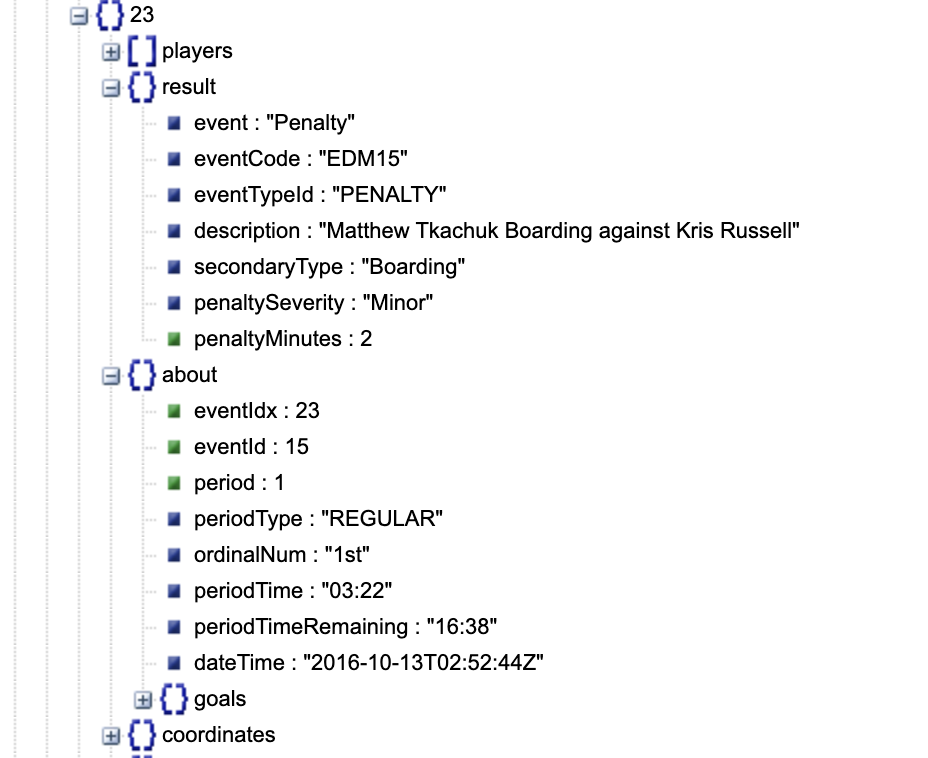

For example, At a particluar penalty event (eventid=23) the strength of the team will go in "Short-Handed" because the penalty is a minor penalty and the strength was "EVEN" before this event. It starts 03:22 and ends in 05:22 till the penalty time is over. We can track this information by keeping track of the penalty time and the penalty severity.

```code
Algorithm:
1. Assume game starts with strength "EVEN"
2. If a penalty event occurs:
	while periodTime<current_periodTime+penaltyMinutes:
		status_of_the_side = #players-1 
```

**Answer 4.3**<br>
Certainly, here are three additional features that can be created from the data available in this dataset:

1. **Rebound Shots Classification**: We can create a feature to classify shots as either "Rebound" by analyzing the sequence of events leading to the shot. If a shot follows a save made by the opposing team's goalie, it can be classified as a "Rebound." We would need to track the events and their timestamps to identify this sequence.

2. **Shot Off the Rush Classification**: To classify shots as "Off the Rush," we can analyze the events leading up to a shot. Shots occurring within a few seconds after a "Takeaway" event or an event indicating a quick transition from the defensive zone to the offensive zone can be categorized as "Off the Rush." This feature would require analyzing the temporal relationship between events.

3. **Player Performance Metrics**: We can create various player-specific performance metrics based on the data available. For example, we can calculate metrics like shooting percentage, save percentage, assist-to-goal ratio, and player impact ratings. These metrics can provide insights into individual player performance and their contributions to the team's success. Addition to this we can analyze team's performance with all oposing teams in a one-vs-all analysis. This will prove well in strategising against opponents

These additional features can offer valuable insights into the dynamics of the game, player performance, and situational analysis. They can be used for in-depth analysis, player evaluations, and strategic decision-making.

## Task 5 - Simple Visualization
**Answer 5.1**<br>

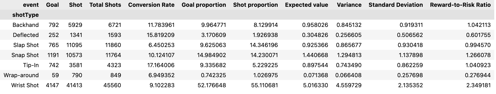

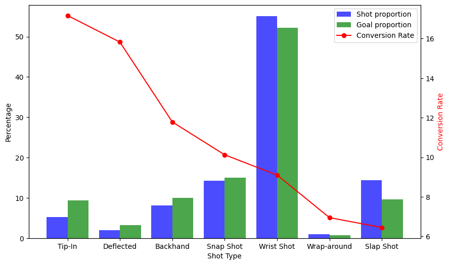

### 1. *Shots Proportion*:
- Represents the frequency with which each type of shot is taken.
- *Interpretation*: Wrist shots have a shots proportion of 0.55, it means that 55% of all shots taken are wrist shots. This can give an insight into the most preferred or frequently used shooting techniques.

### 2. *Goals Proportion*:
- Represents the frequency of goals for each shot type out of the total goals scored.
- *Interpretation*: Wrist shots have a goals proportion of 0.51, it means that 51% of all goals scored resulted from wrist shots. 

### 3. *Conversion Rate (Success Ratio)*:
- Represents the effectiveness of each shot type, or the likelihood of a shot of that type resulting in a goal.
- *Interpretation*: Wrist shots have a conversion rate of 0.09, it means that 9% of all wrist shots taken result in a goal. 

### Analysis:

1. *Identifying Effective Techniques*: 
    - A shot type with a high conversion rate is a more effective technique for scoring. Snap shots have a higher conversion rate than wrist shots, it means players are more likely to score with a snap shot than with a wrist shot when they take one.

2. *Preference vs. Effectiveness*:
    - Contrast shots proportion with conversion rate: 
        - High shots proportion but low conversion rate: Players prefer this shot type, but it might not be the most effective in scoring. For example, wrist shots are taken more often than slap shots, but they are less effective in scoring.
        
        - Low shots proportion but high conversion rate: This shot type isn't used as often but is more effective when used. This could indicate an opportunity to train players in this type of shot. For example, backhand shots are taken less often than wrist shots, but they are more effective in scoring.

3. *Impact on the Game*:
    - Compare goals proportion with conversion rate: 
        - High goals proportion and high conversion rate: This shot type is not only effective but also significantly impacts the game outcomes. Snap shot has a high goals proportion and a high conversion rate, it means that snap shots are not only effective but also frequently used in scoring.
        - High goals proportion but low shots proportion: Indicates a shot type that, while not frequently used, has a significant impact when it is used. For example, tip-in shots are not taken often, but they are effective in scoring.

4. *Strategic Insights*:
    - If a certain shot type has both a high goals proportion and a high conversion rate, teams should be defensively prepared for it like slap shots.
    - On the offensive side, if a shot type has a high conversion rate but a low shots proportion, it could be an underutilized strategy like backhand shots. Teams could train players to use this technique more often to increase their chances of scoring.

5. *Anomalies & Opportunities*:
    - Look for discrepancies: Backhand shots have a low shots proportion but a high conversion rate, it indicates that players aren't taking backhand shots often, but when they do, they tend to be effective. This could be an avenue for teams to explore and capitalize on.


**Which is the most dangerous shot type?**<br>
Just by overlaying the shots played overtop the goals scored we can see that the **Snap shot** is the most dangerous shot type. It has the highest goals proportion and conversion rate. It is also one of the most frequently used shot type. 

On a different school of thought, looking at delta of proportion one might think wrist shot to be the most dangerous but this means that teams would be defensively prepared for wrist shots. Snap shots are played less frequently, has a better conversion rate and more often than not results in a goal.

**Why this figure?**<br>
The multi-axis grouped bar-line chart perfectly encapsulates the information from shots/goals proportion and conversion rate. It also allows us to compare the shot types with each other and see the delta of proportion. The line chart allows us to see the conversion rate of each shot type and compare it with the proportion of goals scored.

**Answer 5.2**<br>
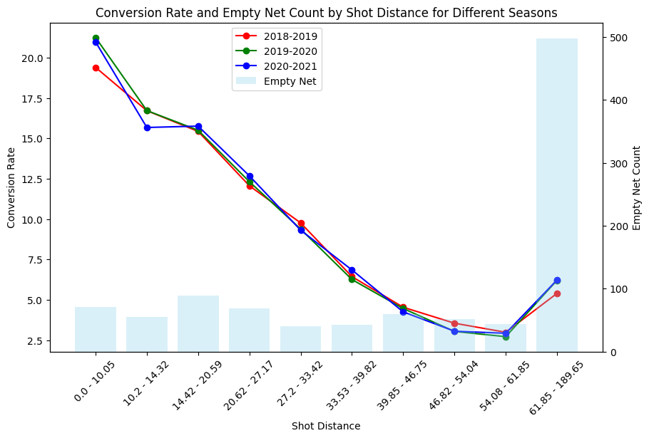

**Analysis of Shot Conversion Rate by Distance Across Seasons**

**Figure Description:** 
The presented graph illustrates the relationship between the distance from which a shot was taken and its conversion rate into a goal across three distinct seasons: 2018-2019, 2019-2020, and 2020-2021. Additionally, an overlaid histogram indicates the number of open-net goals within specific distance buckets, providing context for the sudden upsurge in conversion rates observed in the longest distance bracket.

**Key Observations:**

1. **Inverse Relationship:** Across all three seasons, there is a general trend indicating an inverse relationship between shot distance and conversion rate. As the distance from the goal increases, the probability of converting a shot into a goal diminishes. This observation aligns with intuitive understanding: closer shots, due to their proximity to the net, have a higher likelihood of resulting in goals.

2. **Open-Net Anomaly:** The histogram reveals a significant number of open-net goals in the longest shot distance bucket (61.85-189.65). This surge in open-net goals elucidates the otherwise anomalous spike in conversion rate at that specific range. Open-net situations, where the goaltender is absent, naturally present a higher scoring opportunity, even from afar.

3. **Seasonal Consistency:** The conversion rates across the three seasons largely overlap, suggesting that the fundamental dynamics of shooting and scoring have remained consistent over these years. While there are minor fluctuations, they are not stark enough to infer a significant evolution or change in gameplay strategies.

4. **Figure Selection Rationale:** The chosen figure, combining line graphs with a histogram overlay, was selected for its clarity in representing multiple datasets. The line graphs allow for a straightforward comparison of conversion rates across seasons, while the histogram provides contextual information about open-net goals, which are crucial for understanding outliers in the data.

**Concluding Thoughts:**

The data underscores the challenge of long-range shots in securing goals, a trend consistent over the three seasons. However, situational opportunities like open-net scenarios can drastically improve conversion rates, even from longer distances. Teams and players can glean valuable insights from this data, refining their strategies for shot selection and positioning, especially in high-stakes moments when the goaltender is pulled.


**Answer 5.3**<br>
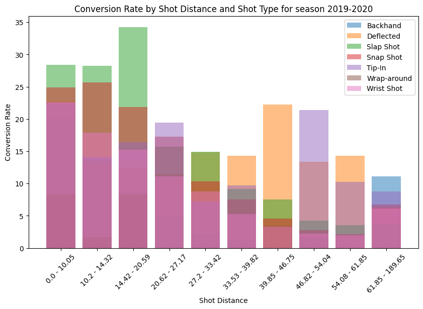

**Figure Description:** 
The graph depicts the goal conversion rate as a function of shot distance, further segmented by various shot types for the 2019-2020 season. Each bar represents a specific shot distance range, and the colored segments within each bar denote the conversion rate of different shot types within that range.


**Key Observations:**

1. **Shortest Distance Shots (0.0 - 10.05)**:
    - Among the shots taken from the shortest distance, the 'Slap Shot' has the highest conversion rate of approximately 28.44%. 
    - 'Wrap-around' shots have the lowest conversion rate in this range at about 8.29%.
    - The remaining shot types ('Backhand', 'Deflected', 'Snap Shot', 'Tip-In', and 'Wrist Shot') have a conversion rate hovering around 20%-25%, with 'Snap Shot' being slightly more effective than others.

2. **Mid-range Shots (10.2 - 27.17)**:
    - The conversion rate generally decreases as the shot distance increases, which is expected as shots from a farther distance tend to be more challenging.
    - Notably, 'Slap Shot' maintains a relatively high conversion rate across these distance ranges, peaking at around 34.27% in the 14.42 - 20.59 range.
    - 'Wrap-around' shots are least effective in these ranges, with the conversion rate dropping to 0% for the 20.62 - 27.17 range.

3. **Longer Range Shots (27.2 - 61.85)**:
    - The overall conversion rates drop significantly in these distance ranges for all shot types.
    - The 'Deflected' shots, however, show sporadic peaks, such as around 22.22% in the 39.85 - 46.75 range and 14.29% in the 54.08 - 61.85 range.
    - 'Slap Shots' remain somewhat consistent, but their effectiveness drops as the distance increases.

4. **Extreme Long Shots (61.85 - 189.65)**:
    - Conversion rates are generally low for all shot types in this range.
    - However, 'Backhand' shots show a surprising peak with a conversion rate of about 11.09%, which is considerably high for such long distances.
    - 'Tip-In' shots also maintain a decent conversion rate at around 8.78%.

**Overall Discussion**:
- **Most Dangerous Shot Type**: The 'Slap Shot' appears to be the most consistently dangerous shot type across various distances, especially in mid-ranges. Its power and speed likely contribute to its high conversion rates.
- **Distance Matters**: As expected, the conversion rate generally decreases as the shot distance from the net increases. However, certain shot types like 'Deflected' and 'Backhand' can surprise with higher conversion rates even from longer distances.

In conclusion, while shot type plays a critical role in goal conversion, the distance from the net is equally crucial. Players and teams can use this information strategically, emphasizing on 'Slap Shots' from mid-ranges and being wary of 'Deflected' and 'Backhand' shots even from long distances.

## Task 6 - Advanced Visualizations: Shot Maps

### Advanced Visualization Notes:
Given a season, we are interested to compute (1) average shot rate per hour of entire league and (2) excess shot rate per hour for a team. 
This data is provided in four json files in this link: https://drive.google.com/drive/folders/1Z7Tp46Sa4nBaLjChgZVGpMmSeyVzEk7M?usp=sharing

1. excess_20162017
2. excess_20172018
3. excess_20182019
4. excess_20192020

Files with the name excess_<season> contain the average excess shot rate per hour for all seasons, and have the following pattern: <team a>:<excess shot rate per hour for team a>. where each excess shot rate per hour for each team is a numpy array. The x and y coordinates for ploting are also saved as numpy arrays. 

#### Analysis Assumptions 
There are three types of `periodType`s in the dataset: `SHOOTOUT`, `OVERTIME`, and `REGULAR`. For the sake of considering the each game only lasts 60 minutes, we remove the `events` that happend within `SHOOTOUT` and `OVERTIME`. 

An important factor to consider is the at each round teams change their rink side. For a fair analysis, we map all the `x_coordinates` and `y_coordinates` of the shots into one location (offensive zone). The following function is used to modify the coordinates. Another important fact is that we don't want to consider shots that happened behind the net, and since the net is located 11 ft from the boarder, we remove the shots from this location. 

In addition, for the sake of visualization, we are going to show the distance from the net as the x axis. The frame of which the rink is usually considered has to be modified too. The usuall rink is $[-100, 100]$ but we transform it to $[0, 89]$. 

```python
def XYCoordinateModification(df): 
    # flipp all rows in which the x_coordinate is negative 
    df_copy = df.copy() 
    condition = df['x_coordinate'] < 0 
    df.loc[condition, ['x_coordinate', 'y_coordinate']] *= -1

    # remove those shots behind the net: shots with x_coordinate bigger than (100-11)=89 
    behind_net = df['x_coordinate'] > 89 
    df = df.drop(df[behind_net].index) 
    
    # in the originial rink: the net is place at 89 and the center is placed at 0. 
    # but for visualization according to the milestone, we want to plot the rink such that the net is placed at 0 and the center at 89. 
    # therefore we shift all x_coordinates 89 steps back 
    df['x_coordinate'] = abs(df['x_coordinate'] - 89)
    return df
```


#### How average shot map is computed? 
Suppose the games dataframe `dfa` and a season `s` are given. We group the dataframe by the seasons, and only consider a subset of the dataframe involving game events for that season. 

Given the dataframe for the season as `ds`, we group by the `x_coordinate` and `y_coordinate`, and count the totall created groups. We also count how many games have been played in the season `s` by counting the unique `game_id`s in the dataframe `ds`. The average shot rate per hour is calculated as the counts for each group of `x_coordinate` and `y_coordinate` divided by the total games. To make it fair, we divide the final result by 2 to account for the fact that there are two teams in the game. The function `ShotRateGroup(ds)` does this job for us after being applied to the subset of the dataframe. 

For computing the average shot rate per hour for each team in `ds`, we group by the `team_names` in `ds`, and perform the previous process. We don't need to divide the final result by 2, as we are only considering one team. Then we subtract the result from the average shot rate per hour of that season. See this example: 

```python
Excess = lambda team_rate, league_rate: team_rate.sub(league_rate, fill_value = 0)
season = 20172018
shot_all = all_season_shot_rate[season]
dfb = dfa[dfa['season'] == season] 
team_names = dfb['team_name'].unique() 
team_shots = dfb.groupby('team_name').apply(ShotRateGroup)
excess  = {name: Excess(team_shots.loc[name], shot_all) for name in team_names}
excess_smooth = {name:Smoother(excess_20162107[name]) for name in team_names}
```

The function `Smoother` is only for a better visualizations performance. This function uses kernel density estimation to smooth out the sharp edges of the contour plot. 

Here is the final result: 


#### How a single figure is plotted? 
Given the `season = 20162017` and `team_name = 'Toronto Maple Leafs'`, the average shot rate for the entire league is computed from `ShotRate(df)` and then `ExcessRate(team, season, df_rate)` function computed the excess shot rate per hour. The result is smoothen out by `SmoothOut(team_name, season, dfa)`. The function `PlotShotMap(team_name, season, z_smooth, x, y)` creates the figure.  


**5.1 - 4 plot offensive zone plots visualization**

We developed this using a Dash Application. We built the application within Dash and then launched it as an overlay on Render. The Dash application is completely interactive, allowing users to make selections based on seasons and teams. You can access our Dash application via the following link:

[Advanced Visualization Shot Map Plot](https://nhlhockeyapp.onrender.com/)

Furthermore, we are providing our HTML plot for your reference:

<iframe src="https://nhlhockeyapp.onrender.com/" title="Advanced Visualizations - Shot Maps" width="990" height="620"> </iframe>


**5.2 - Plot interpretation**

Charts with the net positioned at the top illustrate offensive performance, indicating the number of shots taken by the chosen team. This visual representation conveys how the shot frequency compares to the NHL's average team during the same season, focusing on a specific location. The chart employs three distinct colors: 'red,' 'blue,' and 'white,' each representing different scenarios:

The 'red' region indicates that the team has taken shots at a rate higher than the league average.
The 'blue' region signifies that the team has taken shots at a rate lower than the league average.
The 'white' region represents the team's shots taken at the league-average rate.

By analyzing these graphs, one can assess the offensive capabilities of the selected team. The darker the 'red' region, the higher the density of shots for the selected team, while a darker 'blue' region implies a lower density of shots. The 'white' region shows the number of shots taken by the selected team at the league's average rate.

**5.3 - Discussion on Performance Difference of Colorado Avalanche**

In the 2016-17 season, the shot map indicates that the Colorado Avalanche's performance was fairly average. Most of the regions on the rink show that their shot frequency was in line with the league's average rate. Notable exceptions include two blue patterns, signifying that the team scored fewer goals than the league average rate, particularly close to the goal post. There is also a single red region on the left side of the rink, spanning 40 to 50 feet, where the team exceeded the league's average shot rate.

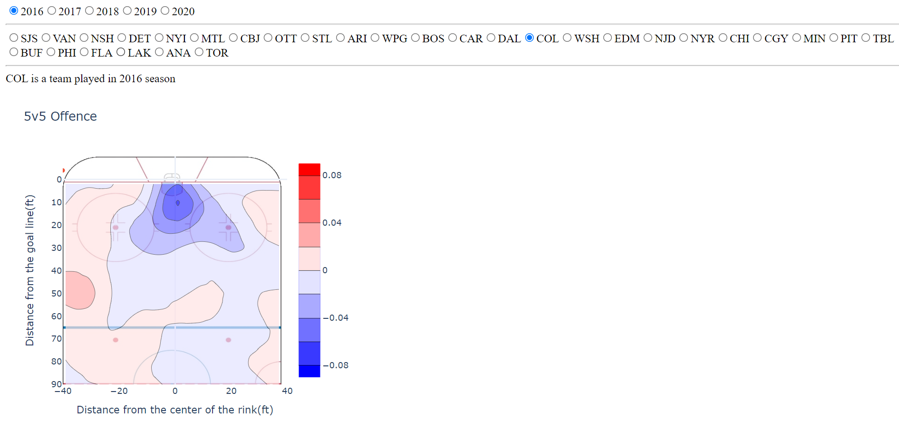

Fast forward to the 2020-21 season, and the overall shot map highlights a stellar performance by the Colorado Avalanche. The majority of the rink is colored in red, indicating that the team's shot frequency surpassed the league average rate, especially near the goal post, the center of the semi-rink, and the left side between 50 to 60 feet. There are only a few instances where the team's shot frequency was below the league average rate, mainly on the right side of the rink between 50 to 60 feet.

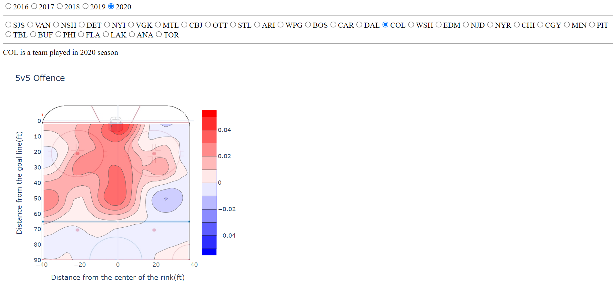

In summary, the Avalanche team's performance in the 2020-21 season was notably superior, with a larger portion of the rink showing shots exceeding the league average rate compared to the 2016-17 season, where their performance wasn't as strong. This assessment is supported by the prominent presence of red regions on the rink in 2020-21, which was not the case in 2016-17.

**5.4 - Performance Comparison between Buffalo Sabres and Tampa Bay Lightning**

Analyzing the graphs reveals that the Tampa Bay Lightning consistently adheres to a strategy of taking the maximum number of shots in front of the goal post on the rink. In all three seasons, they exhibit a red region, indicating that their shot frequency exceeds the league's average rate, prominently positioned in front of the goal post. This stands in contrast to the Buffalo Sabres, as their red regions consistently appear on the sides of the rink.

Furthermore, the Buffalo Sabres display a darker section within the blue region, with this blue region mostly concentrated on the rink, especially during the 2019-20 and 2020-21 seasons. This pattern contributes to their lackluster performance. Notably, in the 2018-19 season, the Sabres do exhibit a red region, but it is not located in front of the goal post, in contrast to the Tampa Bay Lightning, which underscores another aspect contributing to their underperformance.

In summary, one of the key factors contributing to the Tampa Bay Lightning's success is their consistent ability to take shots in front of the goal post that surpass the league's average rate.

Graphs depicting the performance of the Tampa Bay Lightning in the seasons 2018-19, 2019-20, and 2020-21:-

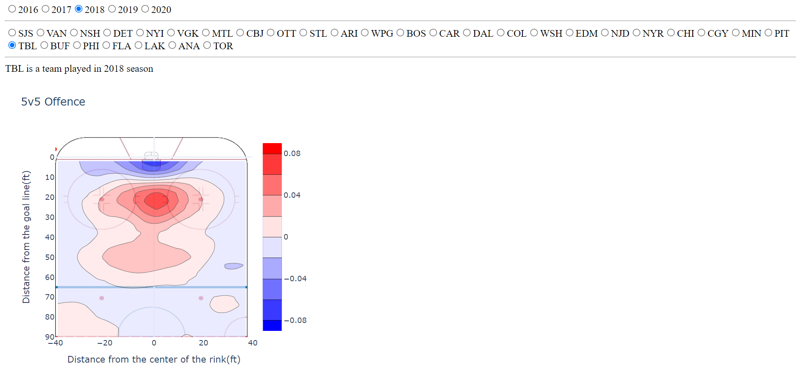

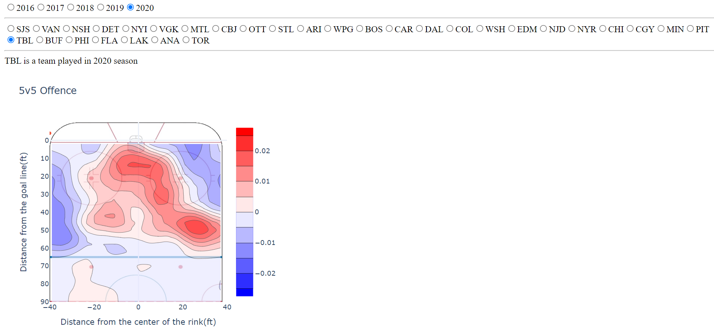

Plots illustrating the performance of the Buffalo Sabres in the 2018-19, 2019-20, and 2020-21 seasons:-

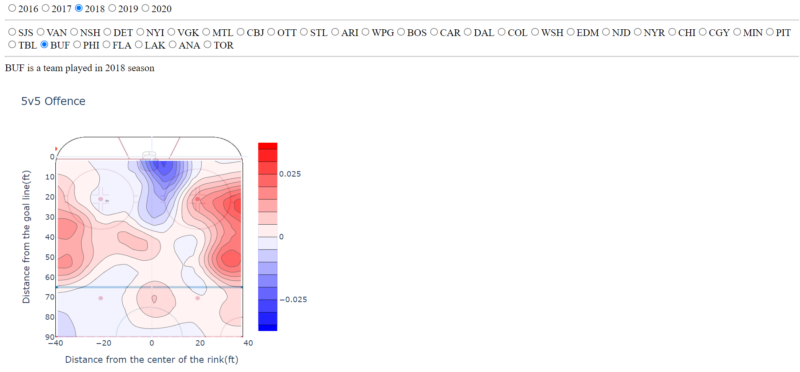
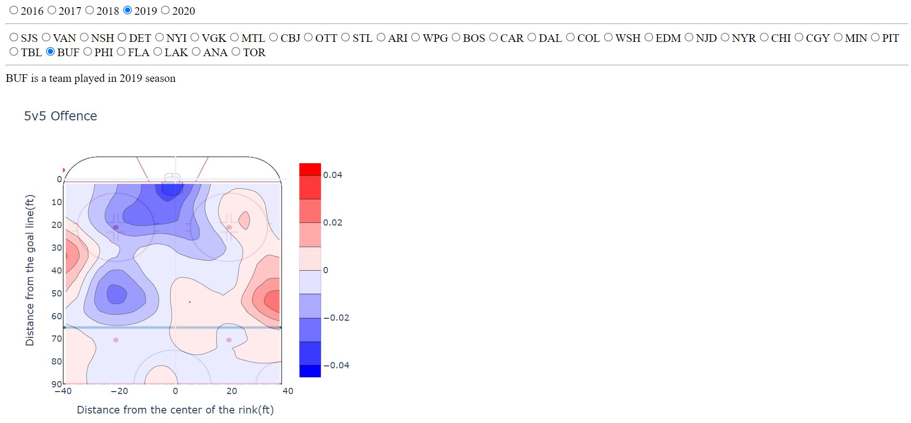
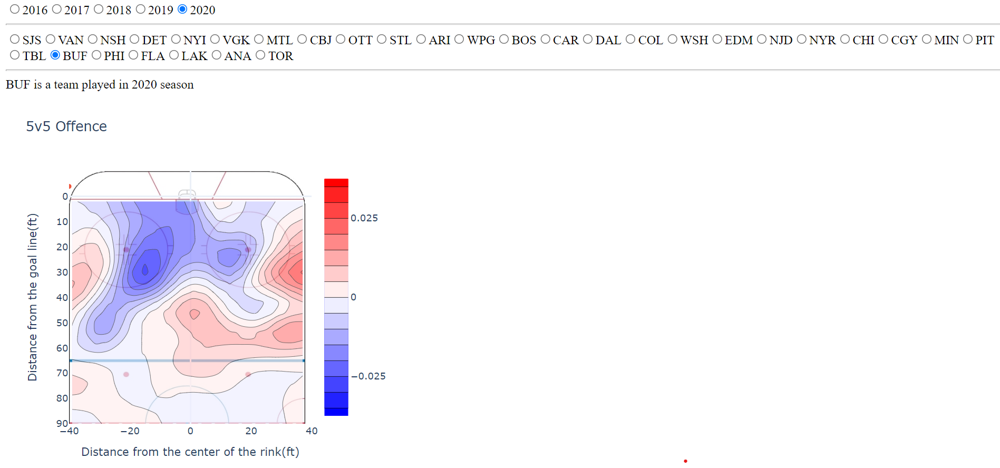

